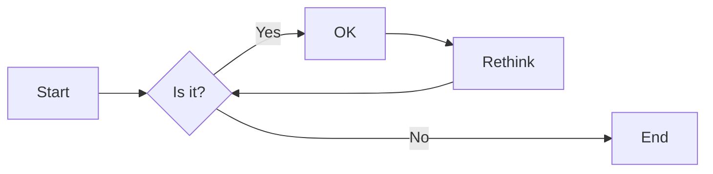
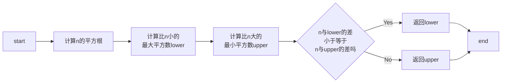
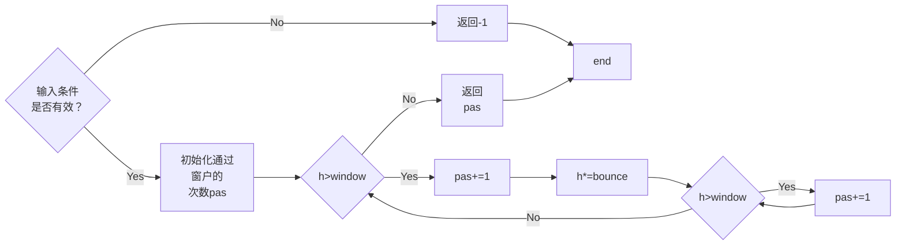
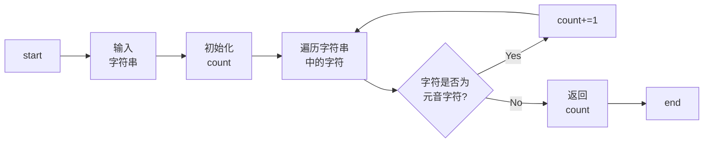

# 实验二 Python变量、简单数据类型

班级： 21计科2班

学号： B20210302209

姓名： 章丽媛

Github地址：<https://github.com/shixiaoxiya/py_course_zly_>

CodeWars地址：<https://www.codewars.com/users/shixiaoxiya>

---

## 实验目的

1. 使用VSCode编写和运行Python程序
2. 学习Python变量和简单数据类型

## 实验环境

1. Git
2. Python 3.10
3. VSCode
4. VSCode插件

## 实验内容和步骤

### 第一部分

实验环境的安装

1. 安装Python，从Python官网下载Python 3.10安装包，下载后直接点击可以安装：[Python官网地址](https://www.python.org/downloads/)
2. 为了在VSCode集成环境下编写和运行Python程序，安装下列VScode插件
   - Python
   - Python Environment Manager
   - Python Indent
   - Python Extended
   - Python Docstring Generator
   - Jupyter
   - indent-rainbow
   - Jinja

---

### 第二部分

Python变量、简单数据类型和列表简介

完成教材《Python编程从入门到实践》下列章节的练习：

- 第2章 变量和简单数据类型

---

### 第三部分

在[Codewars网站](https://www.codewars.com)注册账号，完成下列Kata挑战：

---

#### 第1题：求离整数n最近的平方数（Find Nearest square number）

难度：8kyu

你的任务是找到一个正整数n的最近的平方数
例如，如果n=111，那么nearest_sq(n)（nearestSq(n)）等于121，因为111比100（10的平方）更接近121（11的平方）。
如果n已经是完全平方（例如n=144，n=81，等等），你需要直接返回n。
代码提交地址
<https://www.codewars.com/kata/5a805d8cafa10f8b930005ba>

---

#### 第2题：弹跳的球（Bouncing Balls）

难度：6kyu

一个孩子在一栋高楼的第N层玩球。这层楼离地面的高度h是已知的。他把球从窗口扔出去。球弹了起来,  例如:弹到其高度的三分之二（弹力为0.66）。他的母亲从离地面w米的窗户向外看,母亲会看到球在她的窗前经过多少次（包括球下落和反弹的时候）？

一个有效的实验必须满足三个条件：

- 参数 "h"（米）必须大于0
- 参数 "bounce "必须大于0且小于1
- 参数 “window "必须小于h。

如果以上三个条件都满足，返回一个正整数，否则返回-1。
**注意:只有当反弹球的高度严格大于窗口参数时，才能看到球。**
代码提交地址
<https://www.codewars.com/kata/5544c7a5cb454edb3c000047/train/python>

---

#### 第3题： 元音统计(Vowel Count)

难度： 7kyu

返回给定字符串中元音的数量（计数）。对于这个Kata，我们将考虑a、e、i、o、u作为元音（但不包括y）。输入的字符串将只由小写字母和/或空格组成。

代码提交地址：
<https://www.codewars.com/kata/54ff3102c1bad923760001f3>

---

#### 第4题：偶数或者奇数（Even or Odd）

难度：8kyu

创建一个函数接收一个整数作为参数，当整数为偶数时返回”Even”当整数位奇数时返回”Odd”。
代码提交地址：
<https://www.codewars.com/kata/53da3dbb4a5168369a0000fe>

### 第四部分

使用Mermaid绘制程序流程图

安装Mermaid的VSCode插件：

- Markdown Preview Mermaid Support
- Mermaid Markdown Syntax Highlighting

使用Markdown语法绘制你的程序绘制程序流程图（至少一个），Markdown代码如下：


显示效果如下：




查看Mermaid流程图语法-->[点击这里](https://mermaid.js.org/syntax/flowchart.html)

使用Markdown编辑器（例如VScode）编写本次实验的实验报告，包括[实验过程与结果](#实验过程与结果)、[实验考查](#实验考查)和[实验总结](#实验总结)，并将其导出为 **PDF格式** 来提交。

## 实验过程与结果

### 第二部分 Python变量、简单数据类型和列表简介

#### 练习2.1：简单消息

- 求解代码
  
```python
message='Hello Python!'
print(message)
```

- 运行结果
 
```python
Hello Python!
```

#### 练习2.2：多条简单消息

- 求解代码
  
```python
message='Hello Python!'
print(message)
message='I love Python!'
print(message)
```

- 运行结果
 
```python
Hello Python!
I love Python!
```

#### 练习2.3：个性化消息

- 求解代码
  
```python
name="eric"
message="Hello "+name.title()+",would you like to learn to some Python today?"
print(message)
```

- 运行结果
 
```python
Hello Eric,would you like to learn to some Python today?
```

#### 练习2.4：调整名字的大小写

- 求解代码
  
```python
name="barBEcue"
print(name.title())
print(name.upper())
print(name.lower())
```

- 运行结果
 
```python
Barbecue
BARBECUE
barbecue
```

#### 练习2.5+练习2.6

- 求解代码
  
```python
first_name="albert"
last_name="einstein"
full_name = first_name.title() + " " + last_name.title()
message = full_name + ' once said, "A person who never made a mistake never tried anything new."'
print(message)
```

- 运行结果
 
```python
Albert Einstein once said, "A person who never made a mistake never tried anything new."
```

#### 练习2.7：删除人名中的空白

- 求解代码
  
```python
print("    lily ")
print("\tlily")  
print("\n    lily")    
print("name:\nlily\nalice\nliming")
print("name:\n\tlily\n\talice\n\tliming")
name = " alice "
print(name)
print(name.lstrip())   
print(name.rstrip())   
print(name.strip())  
```

- 运行结果
 
```python
    lily 
	lily

    lily
name:
lily
alice
liming
name:
	lily
	alice
	liming
 alice 
alice 
 alice
alice
```

#### 练习2.9：数字8

- 求解代码
  

```python
print(19 + 88)
print(88 - 22)
print(22 * 4)
print(16 / 2)
```

- 运行结果
 
```python
107
66
88
8.0
```

#### 练习2.10：最喜欢的数

- 求解代码
  
```python
favorite_num = 888
message = "My favorite number is " + str(favorite_num)
print(message)
```

- 运行结果
 
```python
My favorite number is 888
```

### 第三部分 Codewars Kata挑战

#### 第1题:求离整数n最近的平方数（Find Nearest square number）

- 求解代码
  
```python
import math
def nearest_sq(n):
    # 计算 n 的平方根
    sqrt_n = math.isqrt(n)
    
    # 检查两个最接近的平方数：sqrt_n^2 和 (sqrt_n + 1)^2
    lower = sqrt_n ** 2  # 比 n 小的最大平方数
    upper = (sqrt_n + 1) ** 2  # 比 n 大的最小平方数
    
    # 返回最接近的平方数
    if abs(n - lower) <= abs(n - upper):
        return lower
    else:
        return upper
```

- 运行成功结果截图
 


#### 第2题:弹跳的球（Bouncing Balls）

- 求解代码
  
```python
def bouncing_ball(h, bounce, window):
    # 检查输入条件是否有效
    if not (h > 0 and 0 < bounce < 1 and window < h):
        return -1
    
    pas = 0  # 记录通过窗户的次数
    
    while h > window:
        pas += 1  # 小球在下落时通过窗户
        h *= bounce  # 小球弹起
        
        if h > window:
            pas += 1  # 小球在弹起时通过窗户
    return pas

```

- 运行成功结果截图
  


#### 第3题:元音统计(Vowel Count)

- 求解代码
  
```python
def get_count(sentence): 
    # 定义元音字母集合
    vowels = {'a', 'e', 'i', 'o', 'u'}

    # 初始化计数器
    count = 0

    # 遍历字符串中的每个字符
    for char in sentence:
        # 如果字符是元音字母，计数器加1
        if char in vowels:
            count += 1

    return count
```

- 运行成功结果截图
  


#### 第4题:偶数或者奇数（Even or Odd）

- 求解代码

```python
def even_or_odd(number):
    # 检查给定的数字是否为偶数
    if number % 2 == 0:
        return "Even"  # 如果是偶数，返回字符串 "Even"
    else:
        return "Odd"  # 如果是奇数，返回字符串 "Odd"

```

- 运行成功结果截图
  


### 第四部分 使用Mermaid绘制程序流程图

#### 第1题:求离整数n最近的平方数 (Find Nearest square number)



#### 第2题:弹跳的球 (Bouncing Balls)



#### 第3题:元音统计 (Vowel Count)




**注意：不要使用截图，Markdown文档转换为Pdf格式后，截图可能会无法显示。**

## 实验考查

请使用自己的语言并使用尽量简短代码示例回答下面的问题，这些问题将在实验检查时用于提问和答辩以及实际的操作。

1. Python中的简单数据类型有那些？我们可以对这些数据类型做哪些操作？

(1) Python中的简单数据类型包括整数（int）、浮点数（float）、布尔值（bool）、字符串（str）和空值（NoneType）。

(2)操作如下：

- 对于整数和浮点数，我们可以进行加减乘除等基本的数学运算，也可以使用各种数学函数进行高级运算。

- 布尔值只有True和False两个取值，我们可以用它来进行逻辑判断和控制程序流程。

- 字符串是由一系列字符组成的，我们可以使用各种字符串方法对字符串进行操作，比如字符串拼接、分割、替换、查找等等。

- 空值表示没有任何值，它只有一个取值None。我们通常用它来表示函数没有返回值或变量没有被赋值。

- 除了以上基本的操作，Python还提供了很多内置函数和模块，可以对这些简单数据类型进行更加复杂的操作和处理。比如，对于字符串，我们可以使用re模块进行正则表达式匹配，使用json模块进行JSON数据的解析和生成，使用csv模块进行CSV文件的读写等等。
  
 2. 为什么说Python中的变量都是标签？

- Python中的变量实际上是一个标签（或者说是一个引用），指向了一个对象的内存地址。当我们创建一个变量时，实际上是创建了一个标签，并将它指向了一个对象的内存地址。而这个对象可以是任何数据类型，比如整数、浮点数、字符串等等。

- Python中的变量名并不是一个存储数据的容器，而是一个指向存储数据的容器的标签。当我们将一个变量赋值给另一个变量时，实际上是将一个标签指向的对象的内存地址赋值给另一个标签。因此，多个标签可以指向同一个对象，而不是每个标签都存储了一份数据。

- 这种变量标签的机制带来了很多好处。比如，它使得Python中的变量赋值变得非常灵活，我们可以将一个变量赋值给另一个变量，也可以将一个对象赋值给多个变量，还可以使用多个变量引用同一个对象。

- 总之，Python中的变量是标签，而不是容器，这种机制使得Python的变量赋值和使用变得非常灵活和方便。
  
 3. 有哪些方法可以提高Python代码的可读性？

- 使用有意义的变量名：变量名应该能够清晰地表达变量所代表的含义，避免使用过于简单或者过于复杂的变量名。

- 使用注释：注释可以帮助理解代码的含义和作用，但要注意不要写过多的注释，否则反而会影响代码的可读性。

- 使用空格和缩进：合理的空格和缩进可以使代码更加清晰易读，建议使用4个空格作为一级缩进。

- 使用函数和模块：将代码封装成函数和模块可以提高代码的可读性和可维护性，同时也可以避免代码重复。

- 遵循PEP 8规范：PEP 8是Python官方的代码风格指南，遵循这些规范可以使代码风格更加统一，提高代码的可读性。

- 使用合适的命名风格：Python中的命名风格有下划线命名法和驼峰命名法，建议按照PEP 8规范使用下划线命名法。

- 减少代码行长度：代码行长度不宜过长，建议控制在80个字符以内，这样可以避免代码在不同的编辑器和屏幕上显示不完整。

## 实验总结

总结一下这次实验你学习和使用到的知识，例如：编程工具的使用、数据结构、程序语言的语法、算法、编程技巧、编程思想。

- 编程工具的使用：我学习了如何使用Jupyter Notebook来编写Python程序，并且学会了如何运行、保存和分享Notebook文件。

- 数据结构：我学习了Python中的列表(list)、元组(tuple)、字典(dict)、集合(set)等数据结构的定义和基本操作，如索引、切片、添加、删除、排序等操作。

- 程序语言的语法：我学习了Python的基本语法，如变量定义、条件语句、循环语句、函数定义、模块导入等语法，并且了解了Python中的面向对象编程(OOP)和函数式编程(FP)的基本概念和语法。

- 算法：我学习了一些基本的算法，如排序算法、查找算法、递归算法等，并且了解了如何用Python实现这些算法。

- 编程技巧：我学习了一些编程技巧，如调试技巧、代码优化技巧、异常处理技巧、模块化编程技巧等，并且了解了如何在Python中使用一些常用的第三方库和工具，如numpy、pandas、matplotlib、scikit-learn等。

- 编程思想：我学习了一些编程思想，如面向对象编程(OOP)、函数式编程(FP)、设计模式等，并且了解了如何用Python实现这些编程思想。