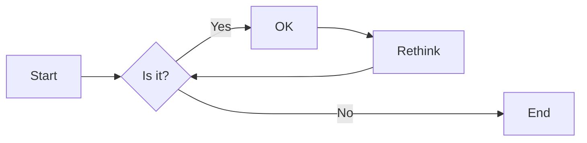
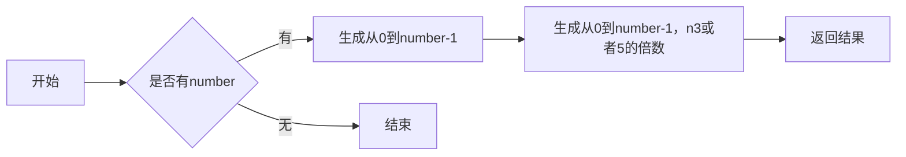
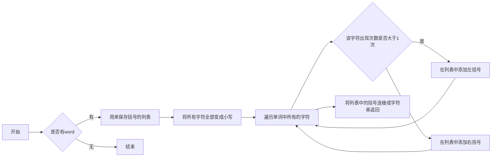
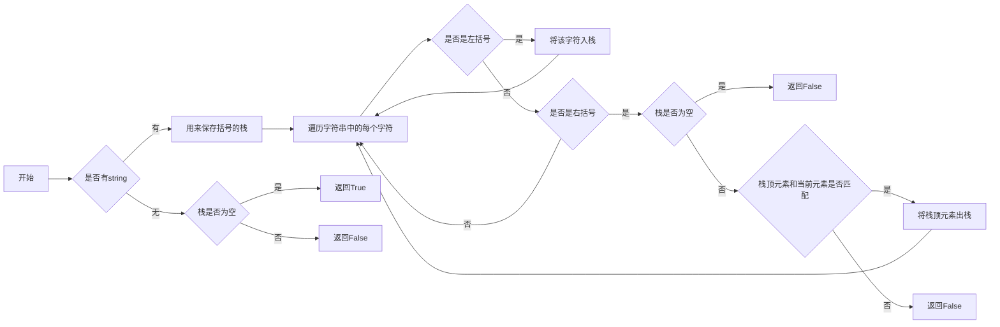
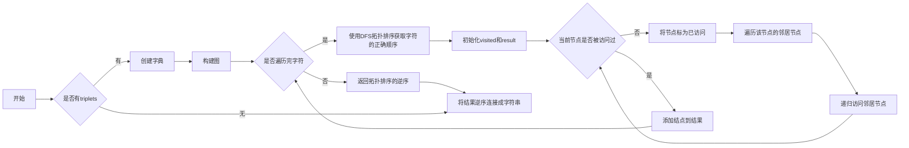
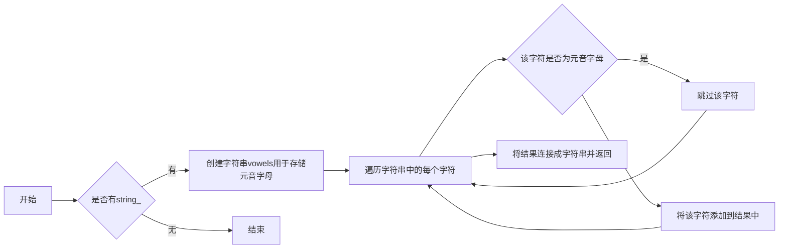

# 实验三 Python列表

班级： 21计科2班

学号： B20210302209

姓名： 章丽媛

Github地址：<https://github.com/shixiaoxiya/py_course_zly_>

CodeWars地址：<https://www.codewars.com/users/shixiaoxiya>

---

## 实验目的

1. 学习Python的简单使用和列表操作
2. 学习Python中的if语句

## 实验环境

1. Git
2. Python 3.10
3. VSCode
4. VSCode插件

## 实验内容和步骤

### 第一部分

Python列表操作

完成教材《Python编程从入门到实践》下列章节的练习：

- 第3章 列表简介
- 第4章 操作列表
- 第5章 if语句

---

### 第二部分

在[Codewars网站](https://www.codewars.com)注册账号，完成下列Kata挑战：

---

#### 第一题：3和5的倍数（Multiples of 3 or 5）

难度： 6kyu

如果我们列出所有低于 10 的 3 或 5 倍数的自然数，我们得到 3、5、6 和 9。这些数的总和为 23. 完成一个函数，使其返回小于某个整数的所有是3 或 5 的倍数的数的总和。此外，如果数字为负数，则返回 0。

注意：如果一个数同时是3和5的倍数，应该只被算一次。

**提示：首先使用列表解析得到一个列表，元素全部是3或者5的倍数。
使用sum函数可以获取这个列表所有元素的和.**

代码提交地址：
<https://www.codewars.com/kata/514b92a657cdc65150000006>

---

#### 第二题： 重复字符的编码器（Duplicate Encoder）

难度： 6kyu

本练习的目的是将一个字符串转换为一个新的字符串，如果新字符串中的每个字符在原字符串中只出现一次，则为"("，如果该字符在原字符串中出现多次，则为")"。在判断一个字符是否是重复的时候，请忽略大写字母。

例如:

```python
"din"      =>  "((("
"recede"   =>  "()()()"
"Success"  =>  ")())())"
"(( @"     =>  "))(("
```

代码提交地址:
<https://www.codewars.com/kata/54b42f9314d9229fd6000d9c>

---

#### 第三题：括号匹配（Valid Braces）

难度：6kyu

写一个函数，接收一串括号，并确定括号的顺序是否有效。如果字符串是有效的，它应该返回True，如果是无效的，它应该返回False。
例如：

```python
"(){}[]" => True 
"([{}])" => True
 "(}" => False
 "[(])" => False 
"[({})](]" => False
```

**提示：
python中没有内置堆栈数据结构，可以直接使用`list`来作为堆栈，其中`append`方法用于入栈，`pop`方法可以出栈。**

代码提交地址
<https://www.codewars.com/kata/5277c8a221e209d3f6000b56>

---

#### 第四题： 从随机三元组中恢复秘密字符串(Recover a secret string from random triplets)

难度： 4kyu

有一个不为你所知的秘密字符串。给出一个随机三个字母的组合的集合，恢复原来的字符串。

这里的三个字母的组合被定义为三个字母的序列，每个字母在给定的字符串中出现在下一个字母之前。"whi "是字符串 "whatisup "的一个三个字母的组合。

作为一种简化，你可以假设没有一个字母在秘密字符串中出现超过一次。

对于给你的三个字母的组合，除了它们是有效的三个字母的组合以及它们包含足够的信息来推导出原始字符串之外，你可以不做任何假设。特别是，这意味着秘密字符串永远不会包含不出现在给你的三个字母的组合中的字母。

测试用例：

```python
secret = "whatisup"
triplets = [
  ['t','u','p'],
  ['w','h','i'],
  ['t','s','u'],
  ['a','t','s'],
  ['h','a','p'],
  ['t','i','s'],
  ['w','h','s']
]
test.assert_equals(recoverSecret(triplets), secret)
```

代码提交地址：
<https://www.codewars.com/kata/53f40dff5f9d31b813000774/train/python>

提示：

- 利用集合去掉`triplets`中的重复字母，得到字母集合`letters`，最后的`secret`应该由集合中的字母组成，`secret`长度也等于该集合。

```python
letters = {letter for triplet in triplets for letter in triplet }
length = len(letters)
```

- 创建函数`check_first_letter(triplets, first_letter)`，检测一个字母是不是secret的首字母，返回True或者False。
- 创建函数`remove_first_letter(triplets, first_letter)`,  从三元组中去掉首字母，返回新的三元组。
- 遍历字母集合letters，利用上面2个函数得到最后的结果`secret`。

---

#### 第五题： 去掉喷子的元音（Disemvowel Trolls）

难度： 7kyu

喷子正在攻击你的评论区!
处理这种情况的一个常见方法是删除喷子评论中的所有元音(字母：a,e,i,o,u)，以消除威胁。
你的任务是写一个函数，接收一个字符串并返回一个去除所有元音的新字符串。
例如，字符串 "This website is for losers LOL!"   将变成 "Ths wbst s fr lsrs LL!".

注意：对于这个Kata来说，y不被认为是元音。
代码提交地址：
<https://www.codewars.com/kata/52fba66badcd10859f00097e>

提示：

- 首先使用列表解析得到一个列表，列表中所有不是元音的字母。
- 使用字符串的join方法连结列表中所有的字母，例如：

```python
last_name = "lovelace"
letters = [letter for letter in last_name ]
print(letters) # ['l', 'o', 'v', 'e', 'l', 'a', 'c', 'e']
name = ''.join(letters) # name = "lovelace"
```

---

### 第三部分

使用Mermaid绘制程序流程图

安装VSCode插件：

- Markdown Preview Mermaid Support
- Mermaid Markdown Syntax Highlighting

使用Markdown语法绘制你的程序绘制程序流程图（至少一个），Markdown代码如下：


显示效果如下：



查看Mermaid流程图语法-->[点击这里](https://mermaid.js.org/syntax/flowchart.html)

使用Markdown编辑器（例如VScode）编写本次实验的实验报告，包括[实验过程与结果](#实验过程与结果)、[实验考查](#实验考查)和[实验总结](#实验总结)，并将其导出为 **PDF格式** 来提交。

## 实验过程与结果

### 第一部分 Python列表操作和if语句

#### 3.1姓名

```python
names = ["张三","李四","王五","赵六"]
print(names[0])
print(names[1])
print(names[2])
```

```python
张三
李四
王五
```

#### 3.2问候语

```python
print(f"{names[0]}您好，欢迎来我家做客！")
print(f"{names[1]}您好，欢迎来我家做客！")
print(f"{names[2]}您好，欢迎来我家做客！")
print(f"{names[3]}您好，欢迎来我家做客！")
```

```python
张三您好，欢迎来我家做客！
李四您好，欢迎来我家做客！
王五您好，欢迎来我家做客！
赵六您好，欢迎来我家做客！
```

#### 3-4嘉宾名单

```python
names = ["张三","李四","王五"]
print(f"我想邀请{names[0]}、{names[1]}、{names[2]}三位同学来做客。")
print(f"由于临时有事，{names[1]}同学无法赴约。")
```

```python
我想邀请张三、李四、王五三位同学来做客。
由于临时有事，李四同学无法赴约。
```

#### 3-5修改嘉宾名单

```python
names[1] = '赵六'
print(f"{names[0]}您好，邀请您周六下午来我家做客。")
print(f"{names[1]}您好，邀请您周六下午来我家做客。")
print(f"{names[2]}您好，邀请您周六下午来我家做客。")
```

```python
张三您好，邀请您周六下午来我家做客。
赵六您好，邀请您周六下午来我家做客。
王五您好，邀请您周六下午来我家做客。
```

#### 3-6添加嘉宾

```python
print(f"由于订到了更大餐厅，再邀请三位同学来做客。")
print(f"添加前：{names}")
names.append('李红')          # 末尾添加李红：用append
names.insert(2,'流星')        # 第三个添加流星：用insert
names.insert(0,'繁星')        # 第一个添加繁星：用insert
print(f"添加后：{names}")
```

```python
由于订到了更大餐厅，再邀请三位同学来做客。
添加前：['张三', '赵六', '王五']
添加后：['繁星', '张三', '赵六', '流星', '王五', '李红'
```

#### 3-7缩减名单

```python

print(f"由于餐桌无法送达，只能邀请两位嘉宾，分别是：流星和繁星。")
 
print(names)
popped_names1 = names.pop()                                                 
print(f"{popped_names1}您好，很抱歉，由于餐桌原因，无法再邀请您来做客。")
 
popped_names2 = names.pop()         
print(f"{popped_names2}您好，很抱歉，由于餐桌原因，无法再邀请您来做客。")
 
second_names = names.pop(1)                                      
print(f"{second_names}您好，很抱歉，由于餐桌原因，无法再邀请您来做客。")
 
third_names = names.pop(1)     
print(f"{third_names}您好，很抱歉，由于餐桌原因，无法再邀请您来做客。")
 
print(names)
print(f"{names[0]}您好，您依然在受邀名单，请准时来赴约。")
print(f"{names[1]}您好，您依然在受邀名单，请准时来赴约。")
 
del names[0]                 
names.remove('流星')          
print(f"确认名单是否为空：{names}")

```

```python
由于餐桌无法送达，只能邀请两位嘉宾，分别是：流星和繁星。
['繁星', '张三', '赵六', '流星', '王五', '李红']
李红您好，很抱歉，由于餐桌原因，无法再邀请您来做客。
王五您好，很抱歉，由于餐桌原因，无法再邀请您来做客。
张三您好，很抱歉，由于餐桌原因，无法再邀请您来做客。
赵六您好，很抱歉，由于餐桌原因，无法再邀请您来做客。
['繁星', '流星']
繁星您好，您依然在受邀名单，请准时来赴约。
流星您好，您依然在受邀名单，请准时来赴约。
确认名单是否为空：[]
```

#### 3.8 放眼世界

```python
areas = ['Ottawa','Sydney','New Zealand','Vancouver','Boston']
print(f"原始顺序:{areas}")
```

```python
原始顺序:['Ottawa', 'Sydney', 'New Zealand', 'Vancouver', 'Boston']
```

##### 用sorted方法

```python

print(f"按字母顺序：{sorted(areas)}")
print(f"核实顺序未变：{areas}")
print(f"按字母相反顺序：{sorted(areas, reverse = True)}")
print(f"sorted方法-顺序情况：{areas}")

```

```python
按字母顺序：['Boston', 'New Zealand', 'Ottawa', 'Sydney', 'Vancouver']
核实顺序未变：['Ottawa', 'Sydney', 'New Zealand', 'Vancouver', 'Boston']
按字母相反顺序：['Vancouver', 'Sydney', 'Ottawa', 'New Zealand', 'Boston']
sorted方法-顺序情况：['Ottawa', 'Sydney', 'New Zealand', 'Vancouver', 'Boston']
```

##### 或者用sort方法

```python

areas.sort()
print(f"按字母表顺序排序：{areas}")
areas.sort(reverse=True)
print(f"按字母表逆序排序：{areas}")
print(f"sort方法-顺序情况：{areas}")
```

```python
按字母表顺序排序：['Ottawa', 'Sydney', 'New Zealand', 'Vancouver', 'Boston']
按字母表逆序排序：['Vancouver', 'Sydney', 'Ottawa', 'New Zealand', 'Boston']
sort方法-顺序情况：['Vancouver', 'Sydney', 'Ottawa', 'New Zealand', 'Boston']
```

##### 用reverse（）修改列表元素的排列顺序，打印该列表，顺序变了

```python
areas.reverse()
print(areas)
```

```python
['Boston', 'New Zealand', 'Ottawa', 'Sydney', 'Vancouver']
```

##### 再次用reverse（），回到原来顺序

```python
areas.reverse()
print(areas)

```

```python
['Vancouver', 'Sydney', 'Ottawa', 'New Zealand', 'Boston']
```

#### 3.9 晚餐嘉宾

```python
names = ["张三","李四","王五"]
length = len(names)
print(f"{names}列表的长度为{length}")
```

```python
['张三', '李四', '王五']列表的长度为3
```

#### 4.1披萨

```python
citys = ['Shanghai','Beijing','Wuhu','Shenzhen','HongKong']
for city in citys:
    print("I like " + city  + ".\n")
print("I really love city.")
```

```python
I like Shanghai.

I like Beijing.

I like Wuhu.

I like Shenzhen.

I like HongKong.

I really love city.
```

#### 4.2动物

```python
animals = ['cat', 'dog', 'panda', 'monkey']
for animal in animals:
    print(animal)
    print(f"A {animal} would make a great pet.")
print("\nAny of these animals would make a great a great pet!")
```

```python
cat
A cat would make a great pet.
dog
A dog would make a great pet.
panda
A panda would make a great pet.
monkey
A monkey would make a great pet.

Any of these animals would make a great a great pet!
```

#### 4-3 数到20

```python
for value in range(1,21):
    print(value)
```

```python
1
2
3
4
5
6
7
8
9
10
11
12
13
14
15
16
17
18
19
20
```

#### 4-4 一百万

```python
one_millions =list(range(1,1000001))
print(f"打印1~1000000的列表：{one_millions}")
```

#### 4-5 计算1~1000000的总和

```python
print(min(one_millions))
print(max(one_millions))
print(sum(one_millions))
```

```python
1
1000000
500000500000
```

#### 4-6 奇数：用range（）创建一个列表，包含1~20的奇数；再用for循环打印出来

```python
odd_numbers = list(range(1,20,2))
print(f"1~20之间的奇数：{odd_numbers}")
 
for value in odd_numbers:     # 再用for循环打印出来
    print(value)
```

```python
1~20之间的奇数：[1, 3, 5, 7, 9, 11, 13, 15, 17, 19]
1
3
5
7
9
11
13
15
17
1
```

#### 4-7 3的倍数：创建一个列表，包含3~30内能被3整除的数字；再用for循环打印出来

```python
three_numbers = list(range(3,31,3))
print(f"3~30之间的奇数：{three_numbers}")
for value in three_numbers:
    print(value)
```

```python
3~30之间的奇数：[3, 6, 9, 12, 15, 18, 21, 24, 27, 30]
3
6
9
12
15
18
21
24
27
30
```

#### 4-8 立方：打印1~10的立方

```python
cubes =[]
for value in range(1,11):
    cube = value*value*value
    cubes.append(cube)
print(cubes)
 
for num in cubes:       
    print(num)
```

```python
[1, 8, 27, 64, 125, 216, 343, 512, 729, 1000]
1
8
27
64
125
216
343
512
729
1000
```

##### 或者：不使用中间变量cube

```python
cubes = []
for value in range(1,11):
    cubes.append(value*value*value)
print(cubes)
```

```python
[1, 8, 27, 64, 125, 216, 343, 512, 729, 1000]
```

#### 4-9 立方解析

```python
cubes = [value*value*value for value in range(1,11) ]
print(f"1~10的立方：{cubes}")
for value in cubes:
    print(value)
```

```python
1~10的立方：[1, 8, 27, 64, 125, 216, 343, 512, 729, 1000]
1
8
27
64
125
216
343
512
729
1000
```

#### 4-10 切片

```python
my_list = [1,2,3,4,5,6,7,8,9]
print(f"前三个元素:{my_list[:3]}")
print(f"中间三个元素：{my_list[3:6]}")
print(f"末尾三个元素：{my_list[-3:]}")
```

```python
前三个元素:[1, 2, 3]
中间三个元素：[4, 5, 6]
末尾三个元素：[7, 8, 9]
```

#### 4-11 你的披萨和我的披萨

```python
my_magicians = ['alice','david','carolina']
friend_magicians = my_magicians[:]    # 相当于副本
my_magicians.append('bob')
friend_magicians.append('liming')
print(f"My_magicians are {my_magicians}")
for my_magician in friend_magicians:
    print(my_magician)
print("\n")
print(f"Friend_magicians are {friend_magicians}")
for friend_magician in friend_magicians:
    print(friend_magician)
```

```python
My_magicians are ['alice', 'david', 'carolina', 'bob']
alice
david
carolina
liming


Friend_magicians are ['alice', 'david', 'carolina', 'liming']
alice
david
carolina
liming
```

#### 4-12 使用多个循环

```python
my_foods = ['pizza', 'falafel', 'carrot cake']
friend_foods = my_foods[:]
for my_food in my_foods:
    print(my_food)
```

```python
pizza
falafel
carrot cake
```

#### 4-13-自助餐

```python
foods = ('rich','peanut','dumpling','potato','cake')  # 创建一个食物元组
for food in foods:
    print(food)
# foods[0] = ice cream   #尝试修改元组，但出现报错，说明元组不可修改
foods = ('rich','beef','dumpling','bacon','noodle')   # 重新定义变量，这是可以的
print("\n")
for food in foods:
    print(food)
```

```python
rich
peanut
dumpling
potato
cake


rich
beef
dumpling
bacon
noodle
```

#### 5-1 条件测试

```python
car = 'subaru'
print(car == 'subaru')
print(car == 'audi')
True
False
False
False 
num = 8
print(num > 10)
print(num < 5)
```

```python
True
False
False
False
```

#### 5-2 更多的条件测试

##### 1.检查两个字符串相等和不等

```python
str1 = 'kan'
str2 = 'can'
print(str1 == str2)
print(str1 != str2)
```

```python
False
True
```

##### 2.使用函数lower()的测试

```python
str1= "aaaaa"
str2 = "AAAAA"
print(str2.casefold())             
print(str2.lower())                
print(str1 == str2.casefold())
print(str1 == str2.lower())

```

```python
aaaaa
aaaaa
True
True
```

##### 3.检查两个数字相等、不等、大于、小于、大于等于和小于等于

```python
num1 = 15
num2 = 33
print(num1 == num2)
print(num1 != num2)
print(num1 > num2)
print(num1 < num2)
print(num1 >= num2)
print(num1 <= num2)
```

```python
False
True
False
True
False
True
```

##### 4.使用关键字and和or的测试

```python

num = 22
if (num > 20) and (num < 30):
    print(True)
else:
    print(False)
 
num = 66
if (num < 33) or (num > 55):
    print(True)
else:
    print(False)
```

```python
True
True
```

##### 5.测试特定的值是否包含在列表中

```python
list = [1, 2, 3, 4, 5, 6]
if 1 in list:
    print(True)
else:
    print(False)
```

```python
True
```

##### 6.测试特点的值是否未包含在列表中

```python
list = [1, 2, 3, 4, 5, 6]
if 10 not in list:
    print(True)
else:
    print(False)
```

```python
True
```

#### 5-3 外星人颜色

```python
print("----------版本1----------------")
alien_color = ['green', 'yellow', 'red']
alien_color_dis = 'green'
if alien_color_dis in alien_color:
    print("获得5个点\n")
print("----------版本2----------------")
alien_color = ['yellow', 'red']
alien_color_dis = 'green'
if alien_color_dis in alien_color:
    print("获得5个点")
```

```python
----------版本1----------------
获得5个点

----------版本2----------------
```

#### 5-4 外星人颜色2

```python
print("----------版本1----------------")
alien_color = ['green', 'yellow', 'red']
alien_color_dis = 'green'
if alien_color_dis in alien_color:
    print("获得5个点")
else:
    print("获得10个点")
 
print("\n----------版本2----------------")
alien_color = ['yellow', 'red']
alien_color_dis = 'green'
if alien_color_dis in alien_color:
    print("获得5个点")
else:
    print("获得10个点")
```

```python
----------版本1----------------
获得5个点

----------版本2----------------
获得10个点
```

#### 5-5 外星人颜色3

```python
print("----------版本1----------------")
alien_color = ['green', 'yellow', 'red']
if 'green' in alien_color:
    print("获得5个点")
elif 'yellow' in alien_color:
    print("获得10个点")
elif 'red' in alien_color:
    print("获得15个点")
 
print("\n----------版本2----------------")
alien_color = ['yellow', 'red']
if 'green' in alien_color:
    print("获得5个点")
elif 'yellow' in alien_color:
    print("获得10个点")
elif 'red' in alien_color:
    print("获得15个点")
 
print("\n----------版本3----------------")
alien_color = ['red']
if 'green' in alien_color:
    print("获得5个点")
elif 'yellow' in alien_color:
    print("获得10个点")
elif 'red' in alien_color:
    print("获得15个点")
```

```python
----------版本1----------------
获得5个点

----------版本2----------------
获得10个点

----------版本3----------------
获得15个点
```

#### 5-6 人生的不同阶段

```python
age = 10
 
if age < 2:
    print("他是个婴儿。")
 
elif 2 <= age < 4:
    print("他正在蹒跚学步。")
 
elif 4 <= age < 13:
    print("他是儿童。")
 
elif 13 <= age < 20:
    print("他是青少年。")
 
elif 20 <= age < 65:
    print("他是成年人。")
 
else :
    print("他是老年人。")
```

```python
他是儿童。
```

#### 5-7 喜欢的水果

```python
favorite_fruits = ['apple', 'banana', 'orange']
if 'apple' in favorite_fruits:
    print(f"You really like {favorite_fruits[0]}")
if 'banana' in favorite_fruits:
    print(f"You really like {favorite_fruits[1]}")
if 'orange' in favorite_fruits:
    print(f"You really like {favorite_fruits[2]}")
if 'pear' in favorite_fruits:
    print(f"You really like pear")
if 'cherry' in favorite_fruits:
    print(f"You really like cherry")
```

```python
You really like apple
You really like banana
You really like orange
```

#### 5-8 以特殊方式跟管理员打招呼

```python
names = ['bob', 'admin', 'alice', 'jake', 'licy']
for name in names:
    if name == 'admin':
        print("Hello admin, would you like to see a status report?")
    else:
        print("Hello " + name.title() + ", thank you for logging in again.")
```

```python
Hello Bob, thank you for logging in again.
Hello admin, would you like to see a status report?
Hello Alice, thank you for logging in again.
Hello Jake, thank you for logging in again.
Hello Licy, thank you for logging in again.
```

#### 5-9 处理没有用户的情形

```python
names = ['bob', 'admin', 'alice', 'jake', 'licy']
if names:   
    for name in names:
        if name == 'admin':
            print("Hello admin, would you like to see a status report?")
        else:
            print("Hello " + name + ", thank you for logging in again.")
else:      
    print("We need to find some users!")
print(names)
names.remove('bob')
names.remove('admin')
names.remove('alice')
names.remove('jake')
names.remove('licy')    
print(names)
```

```python
Hello bob, thank you for logging in again.
Hello admin, would you like to see a status report?
Hello alice, thank you for logging in again.
Hello jake, thank you for logging in again.
Hello licy, thank you for logging in again.
['bob', 'admin', 'alice', 'jake', 'licy']
[]
```

#### 5-10 检查用户名

```python
current_users = ['bob', 'admin', 'alice', 'jake', 'licy']
new_users = ['anlen', 'Alice', 'admin', 'demo', 'nomi']
for new_user in new_users:
    if new_user.lower() in current_users:
        print(f"{new_user}该用户名已被使用，请换一个用户名。")
    else:
        print(f"{new_user}该用户名未被使用。")
```

```python
anlen该用户名未被使用。
Alice该用户名已被使用，请换一个用户名。
admin该用户名已被使用，请换一个用户名。
demo该用户名未被使用。
nomi该用户名未被使用。
```

#### 5-11 序数

```python

lists = list(range(1, 10))
for list in lists:
    if list == 1:
        print('1st')
    elif list == 2:
        print('2nd')
    elif list == 3:
        print('3rd')
    else:
        print(f"{list}th")

```

```python
1st
2nd
3rd
4th
5th
6th
7th
8th
9th
```

### 第二部分 Codewars Kata挑战

#### 第一题:3和5的倍数（Multiples of 3 or 5）

```python
def solution(number):
    
    # 从0到number-1的整数
    numbers = [i for i in range(number)]
    
    # 从0到number-1的整数中，3或者5的倍数
    multi3or5 =  [i for i in range(number) if i%3==0 or i%5==0]
    
    # 返回结果
    return sum(multi3or5)   
```

将上面的代码写成一句话，就是下面的结果：

```python
def solution(number):
    return sum(i for i in range(number)
               if i%3 == 0 or i%5 == 0) 
```

利用等差数列直接计算3的倍数、5的倍数、15的倍数，结果 = 3的倍数+5的倍数-15的倍数

```python
def solution(number):
    if number < 0:
        return 0
    a,b,c = (number-1)//3, (number-1)//5, (number-1)//15
    x,y,z = (3+3*a)*a/2, (5+5*b)*b/2, (15+15*c)*c/2
    return x+y-z
```

运行成功结果截图
  


#### 第二题:重复字符的编码器（Duplicate Encoder）

```python
def duplicate_encode(word):
    # 用来保存括号的列表
    result = []
    
    # 将所有字符全部变成小写
    word = word.lower()
    
    # 遍历单词中所有的字符
    for c in word:
        # 如果该字符出现次数大于1次，在列表中添加`)`
        if word.count(c) > 1:
            result.append(')')
        # 如果该字符出现次数大于1次，在列表中添加`(`
        else:
            result.append('(') 
    
    # 将列表中的括号连接成字符串返回
    return ''.join(result)

```

将上面的代码使用列表解析简化

```python
def duplicate_encode(word):
    word = word.lower()
    return ''.join('(' if word.count(c)<2 else ')' for c in word)
```

利用collections.Counter类

```python
from collections import Counter

word = "hello world, sun is shining today"

word = word.lower()
counter = Counter(word)
counter
```

运行成功结果截图
  


#### 第三题:括号匹配（Valid Braces）

```python
braces = "(){}[]" # 括号字符串
dict_braces = {'}': '{', ']': '[', ')': '('}

def validBraces(string):
    stack = [] # 用来保存括号的栈
    for c in string:
        # 如果是左括号，就入栈
        if c in '({[':
            stack.append(c)
        # 如果是右括号
        elif c in ')}]':
            # 如果栈为空，返回False
            if not stack:
                return False
            # 如果栈顶元素和当前元素不匹配，返回False
            if stack[-1] != dict_braces[c]:
                return False
            # 如果栈顶元素和当前元素匹配，就出栈
            else:
                stack.pop()
    # 如果栈为空，返回True
    if not stack:
        return True
    # 如果栈不为空，返回False
    else:
        return False
```

运行成功结果截图


#### 第四题:从随机三元组中恢复秘密字符串(Recover a secret string from random triplets)

```python
def recoverSecret(triplets):
    # 创建字典用于存储字符的相对顺序
    graph = {}

    # 构建图，记录字符的相对顺序
    for triplet in triplets:
        for char in triplet:
            if char not in graph:
                graph[char] = set()
    
        graph[triplet[0]].add(triplet[1])
        graph[triplet[1]].add(triplet[2])

    # 使用深度优先搜索（DFS）拓扑排序获取字符的正确顺序
    visited = set()
    result = []

    def dfs(node):
        if node not in visited:
            visited.add(node)
            for neighbor in graph[node]:
                dfs(neighbor)
            result.append(node)

    for node in graph:
        dfs(node)

    # 返回拓扑排序的逆序，即原始字符串
    return ''.join(result[::-1])

```

运行成功结果截图


#### 第五题:去掉喷子的元音（Disemvowel Trolls）

```python
def disemvowel(string_):
    vowels = 'aeiouAEIOU'
    disemvoweled_string = ''.join([char for char in string_ if char not in vowels])
    return disemvoweled_string
```

运行成功结果截图


### 第三部分 使用Mermaid绘制程序流程图

#### 第一题：3和5的倍数(Multiples of 3 or 5)



#### 第二题：重复字符的编码器(Duplicate Encoder)



#### 第三题：括号匹配(Valid Braces)



#### 第四题：从随机三元组中恢复秘密字符串(Recover a secret string from random triplets)



#### 第五题：去掉喷子的元音（Disemvowel Trolls）



## 实验考查

请使用自己的语言并使用尽量简短代码示例回答下面的问题，这些问题将在实验检查时用于提问和答辩以及实际的操作。

**1. Python中的列表可以进行哪些操作？**

- 增加元素：使用append()方法在列表末尾添加一个元素，使用insert()方法在指定位置插入一个元素，使用extend()方法将另一个列表中的元素添加到该列表末尾。

- 删除元素：使用remove()方法删除指定元素，使用pop()方法删除指定位置的元素并返回该元素，使用del语句删除指定位置的元素。

- 修改元素：通过索引直接修改指定位置的元素。

- 查找元素：使用index()方法查找指定元素在列表中的位置，使用count()方法统计指定元素在列表中出现的次数。

- 切片操作：通过切片操作可以获取列表中的一部分元素，例如list[1:3]表示获取列表中索引从1到2的元素。

- 排序：使用sort()方法对列表进行升序排序，使用reverse()方法将列表倒序。

- 迭代：使用for循环可以遍历列表中的所有元素。

- 其他操作：可以使用len()函数获取列表的长度，使用in关键字判断某个元素是否在列表中，使用+运算符将两个列表合并成一个新列表。
  
**2. 哪两种方法可以用来对Python的列表排序？这两种方法有和区别？**

Python的列表可以通过sort()方法和sorted()函数进行排序。

- sort()方法：该方法会在原列表上直接进行排序，不会返回新的列表，使用方法为list.sort()。可以通过参数reverse指定是否降序排序，默认为升序排序。

- sorted()函数：该函数会返回一个新的排序后的列表，不会影响原列表，使用方法为sorted(list)。可以通过参数reverse指定是否降序排序，默认为升序排序。

- 两种方法的主要区别是sort()方法会改变原列表，而sorted()函数不会改变原列表，返回一个新的排序后的列表。因此，如果需要保留原列表，可以使用sorted()函数，否则可以使用sort()方法。

**3. 如何将Python列表逆序打印？**

- Python中可以使用reverse()方法将列表逆序，然后使用for循环遍历列表并打印即可。代码示例如下：

```python
my_list = [1, 2, 3, 4, 5]
my_list.reverse()  # 将列表逆序
for item in my_list:
    print(item)
```

- 另外，也可以使用切片操作将列表逆序，并使用for循环遍历列表并打印。代码示例如下：

```python
my_list = [1, 2, 3, 4, 5]
for item in my_list[::-1]:  # 使用切片操作将列表逆序
    print(item)
```

**4. Python中的列表执行哪些操作时效率比较高？哪些操作效率比较差？是否有类似的数据结构可以用来替代列表？**

Python中的列表执行以下操作时效率比较高：

- 获取列表中某个元素的值，使用索引list[i]。

- 在列表末尾添加元素，使用append()方法。

- 切片操作list[i:j]。

- 遍历列表，使用for循环。

Python中的列表执行以下操作时效率比较低：

- 在列表中间插入或删除元素，使用insert()、remove()、pop()等方法。

- 判断列表中是否包含某个元素，使用in操作符或index()方法。

- 对列表进行排序，使用sort()方法或sorted()函数。

如果需要在中间频繁插入或删除元素，可以考虑使用collections.deque来代替列表。deque是双向队列，支持从两端进行插入和删除操作，因此在中间插入或删除元素时效率比列表高。

另外，如果需要对列表进行快速排序、查找等操作，可以使用numpy.array或pandas.Series等数据结构来代替列表。这些数据结构基于数组实现，支持向量化操作，因此在数值计算方面效率比列表高。

**5. 阅读《Fluent Python》Chapter 2. An Array of Sequence - Tuples Are Not Just Immutable Lists小节（p30-p35）。总结该小节的主要内容。**

主要讲解了Python中的元组（Tuple）数据类型，总结如下：

- 元组是不可变的有序序列，可以包含任意类型的元素，用逗号分隔。元组的不可变性意味着元组的长度和元素不可更改。元组可以通过圆括号或者省略括号的方式创建。

- 元组可以通过索引访问元素，也可以通过切片操作获取子元组。元组的索引从0开始，可以使用负数索引从后往前访问元素。元组支持切片操作，可以通过切片操作获取元组的子元组。

- 元组可以作为字典的键，因为元组是不可变的，不会发生哈希冲突。字典中的键必须是不可变类型，因此元组可以作为字典的键。

- 元组可以作为函数的参数和返回值，可以用于简单的数据结构传递。元组可以作为函数的参数和返回值，可以用于简单的数据结构传递，因为元组是不可变的，可以保证传递的数据不会被修改。

- 元组可以用于多个变量的赋值操作，可以方便地交换两个变量的值。多个变量可以同时赋值为一个元组，也可以通过解包元组的方式将元组的值分配给多个变量。通过多个变量的赋值操作可以方便地交换两个变量的值。

- 元组可以使用+运算符将两个元组合并成一个新元组，也可以使用*运算符将元组重复多次。使用+运算符可以将两个元组合并成一个新元组，使用*运算符可以将元组重复多次。

- 元组中的元素可以是可变对象，但元组本身不可变，因此元组中的可变对象不能被修改，但可以修改其属性。元组中的元素可以是可变对象，例如列表，但元组本身不可变，因此元组中的可变对象不能被修改，但可以修改其属性。

- namedtuple是一种具名元组，可以用于定义简单的数据结构，提高代码可读性。namedtuple是一种具名元组，可以通过字段名来访问元组中的元素，提高了代码的可读性。

- 元组和列表的选择取决于具体的应用场景，如果需要存储的元素是不可变的，建议使用元组，否则使用列表。元组和列表都是序列类型，可以存储多个元素。元组适用于存储不可变的数据，例如日期、时间等，而列表适用于存储可变的数据，例如用户列表等。

## 实验总结

**总结一下这次实验你学习和使用到的知识，例如：编程工具的使用、数据结构、程序语言的语法、算法、编程技巧、编程思想。**

- 编程工具的使用：我们使用了Jupyter Notebook作为编程工具，它是一个非常方便的交互式编程环境，可以快速地进行代码编写、调试和运行。
- 数据结构：我们学习和使用了Python语言中的各种数据结构，如列表、字符串、字典、集合等等，这些数据结构非常常见，是我们进行编程的基础。
- 程序语言的语法：我们学习了Python语言的基本语法，如变量、条件语句、循环语句、函数等，这些语法是我们进行编程的基础。
- 算法：我们学习了一些常见的算法，如计算一个数列中所有3或5的倍数的和、判断括号字符串是否合法、恢复原始字符串、删除一个字符串中的元音字母等等，这些算法可以帮助我们解决实际问题。
- 编程技巧：我们学习和使用了一些编程技巧，如列表推导式、集合操作、字典操作、字符串操作等等，这些技巧可以帮助我们更加简洁和高效地编写代码。
- 编程思想：我们学习了一些编程思想，如图论、递归等等，这些思想可以帮助我们更好地理解和解决问题。
