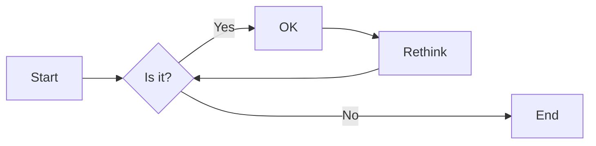
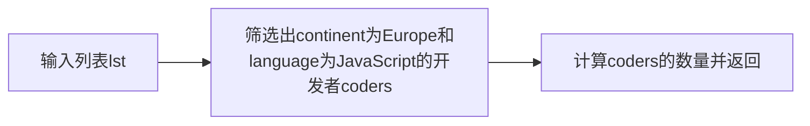
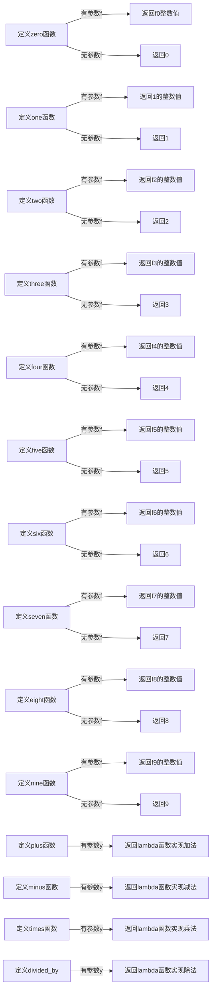
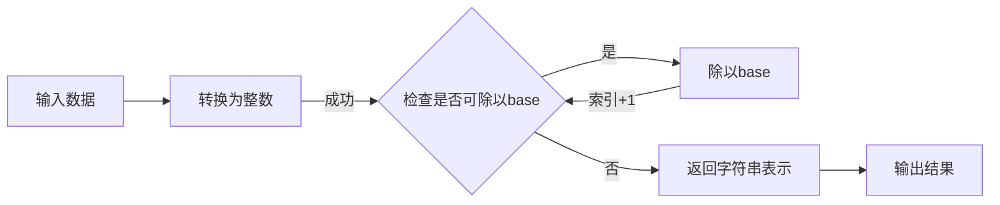
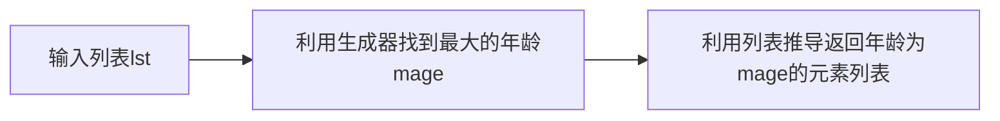
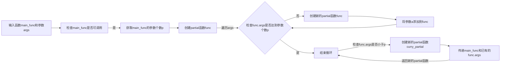

# 实验六 Python函数

班级： 21计科2班

学号： B20210302209

姓名： 章丽媛

Github地址：<https://github.com/shixiaoxiya/py_course_zly_/blob/main/Experiments/experiment6.md>

CodeWars地址：<https://www.codewars.com/users/shixiaoxiya>

---

## 实验目的

1. 学习Python函数的基本用法
2. 学习lambda函数和高阶函数的使用
3. 掌握函数式编程的概念和实践

## 实验环境

1. Git
2. Python 3.10
3. VSCode
4. VSCode插件

## 实验内容和步骤

### 第一部分

Python函数

完成教材《Python编程从入门到实践》下列章节的练习：

- 第8章 函数

---

### 第二部分

在[Codewars网站](https://www.codewars.com)注册账号，完成下列Kata挑战：

---

#### 第一题：编码聚会1

难度： 7kyu

你将得到一个字典数组，代表关于首次报名参加你所组织的编码聚会的开发者的数据。
你的任务是返回来自欧洲的JavaScript开发者的数量。
例如，给定以下列表：

```python
lst1 = [
  { 'firstName': 'Noah', 'lastName': 'M.', 'country': 'Switzerland', 'continent': 'Europe', 'age': 19, 'language': 'JavaScript' },
  { 'firstName': 'Maia', 'lastName': 'S.', 'country': 'Tahiti', 'continent': 'Oceania', 'age': 28, 'language': 'JavaScript' },
  { 'firstName': 'Shufen', 'lastName': 'L.', 'country': 'Taiwan', 'continent': 'Asia', 'age': 35, 'language': 'HTML' },
  { 'firstName': 'Sumayah', 'lastName': 'M.', 'country': 'Tajikistan', 'continent': 'Asia', 'age': 30, 'language': 'CSS' }
]
```

你的函数应该返回数字1。
如果，没有来自欧洲的JavaScript开发人员，那么你的函数应该返回0。

注意：
字符串的格式将总是"Europe"和"JavaScript"。
所有的数据将始终是有效的和统一的，如上面的例子。

这个卡塔是Coding Meetup系列的一部分，其中包括一些简短易行的卡塔，这些卡塔是为了让人们掌握高阶函数的使用。在Python中，这些方法包括：`filter`, `map`, `reduce`。当然也可以采用其他方法来解决这些卡塔。

[代码提交地址](https://www.codewars.com/kata/coding-meetup-number-1-higher-order-functions-series-count-the-number-of-javascript-developers-coming-from-europe)

---

#### 第二题： 使用函数进行计算

难度：5kyu

这次我们想用函数来写计算，并得到结果。让我们看一下一些例子：

```python
seven(times(five())) # must return 35
four(plus(nine())) # must return 13
eight(minus(three())) # must return 5
six(divided_by(two())) # must return 3
```

要求：

- 从0（"零"）到9（"九"）的每个数字都必须有一个函数。
- 必须有一个函数用于以下数学运算：加、减、乘、除。
- 每个计算都由一个操作和两个数字组成。
- 最外面的函数代表左边的操作数，最里面的函数代表右边的操作数。
- 除法应该是整数除法。

例如，下面的计算应该返回2，而不是2.666666...。

```python
eight(divided_by(three()))
```

代码提交地址：
<https://www.codewars.com/kata/525f3eda17c7cd9f9e000b39>

---

#### 第三题： 缩短数值的过滤器(Number Shortening Filter)

难度：6kyu

在这个kata中，我们将创建一个函数，它返回另一个缩短长数字的函数。给定一个初始值数组替换给定基数的 X 次方。如果返回函数的输入不是数字字符串，则应将输入本身作为字符串返回。

例子：

```python
filter1 = shorten_number(['','k','m'],1000)
filter1('234324') == '234k'
filter1('98234324') == '98m'
filter1([1,2,3]) == '[1,2,3]'
filter2 = shorten_number(['B','KB','MB','GB'],1024)
filter2('32') == '32B'
filter2('2100') == '2KB';
filter2('pippi') == 'pippi'
```

代码提交地址：
<https://www.codewars.com/kata/56b4af8ac6167012ec00006f>

---

#### 第四题： 编码聚会7

难度： 6kyu

您将获得一个对象序列，表示已注册参加您组织的下一个编程聚会的开发人员的数据。

您的任务是返回一个序列，其中包括最年长的开发人员。如果有多个开发人员年龄相同，则将他们按照在原始输入数组中出现的顺序列出。

例如，给定以下输入数组：
```python
list1 = [
  { 'firstName': 'Gabriel', 'lastName': 'X.', 'country': 'Monaco', 'continent': 'Europe', 'age': 49, 'language': 'PHP' },
  { 'firstName': 'Odval', 'lastName': 'F.', 'country': 'Mongolia', 'continent': 'Asia', 'age': 38, 'language': 'Python' },
  { 'firstName': 'Emilija', 'lastName': 'S.', 'country': 'Lithuania', 'continent': 'Europe', 'age': 19, 'language': 'Python' },
  { 'firstName': 'Sou', 'lastName': 'B.', 'country': 'Japan', 'continent': 'Asia', 'age': 49, 'language': 'PHP' },
]
```

您的程序应该返回如下结果：

```python
[
  { 'firstName': 'Gabriel', 'lastName': 'X.', 'country': 'Monaco', 'continent': 'Europe', 'age': 49, 'language': 'PHP' },
  { 'firstName': 'Sou', 'lastName': 'B.', 'country': 'Japan', 'continent': 'Asia', 'age': 49, 'language': 'PHP' },
]
```

注意：

- 输入的列表永远都包含像示例中一样有效的正确格式的数据，而且永远不会为空。

代码提交地址：
<https://www.codewars.com/kata/582887f7d04efdaae3000090>

---

#### 第五题： Currying versus partial application

难度： 4kyu

[Currying versus partial application](https://2ality.com/2011/09/currying-vs-part-eval.html)是将一个函数转换为具有更小arity(参数更少)的另一个函数的两种方法。虽然它们经常被混淆，但它们的工作方式是不同的。目标是学会区分它们。

Currying

是一种将接受多个参数的函数转换为以每个参数都只接受一个参数的一系列函数链的技术。

Currying接受一个函数：

```python
f：X × Y → R
```

并将其转换为一个函数：

```python
f'：X → (Y → R)
```

我们不再使用两个参数调用f，而是使用第一个参数调用f'。结果是一个函数，然后我们使用第二个参数调用该函数来产生结果。因此，如果非curried f被调用为：

```python
f(3, 5)
```

那么curried f'被调用为：

```python
f'(3)(5)
```

示例
给定以下函数：

```python
def add(x, y, z):
  return x + y + z
```

我们可以以普通方式调用：

```python
add(1, 2, 3) # => 6
```

但我们可以创建一个curried版本的add(a, b, c)函数：

```python
curriedAdd = lambda a: (lambda b: (lambda c: add(a,b,c)))
curriedAdd(1)(2)(3) # => 6
```

Partial application
是将一定数量的参数固定到函数中，从而产生另一个更小arity(参数更少)的函数的过程。

部分应用接受一个函数：

```python
f：X × Y → R
```

和一个固定值x作为第一个参数，以产生一个新的函数

```python
f'：Y → R
```

f'与f执行的操作相同，但只需要填写第二个参数，这就是其arity比f的arity少一个的原因。可以说第一个参数绑定到x。

示例:

```python
partialAdd = lambda a: (lambda *args: add(a,*args))
partialAdd(1)(2, 3) # => 6
```

你的任务是实现一个名为curryPartial()的通用函数，可以进行currying或部分应用。

例如：

```python
curriedAdd = curryPartial(add)
curriedAdd(1)(2)(3) # => 6

partialAdd = curryPartial(add, 1)
partialAdd(2, 3) # => 6
```

我们希望函数保持灵活性。

所有下面这些例子都应该产生相同的结果：

```python
curryPartial(add)(1)(2)(3) # =>6 
curryPartial(add, 1)(2)(3) # =>6 
curryPartial(add, 1)(2, 3) # =>6 
curryPartial(add, 1, 2)(3) # =>6 
curryPartial(add, 1, 2, 3) # =>6 
curryPartial(add)(1, 2, 3) # =>6 
curryPartial(add)(1, 2)(3) # =>6 
curryPartial(add)()(1, 2, 3) # =>6 
curryPartial(add)()(1)()()(2)(3) # =>6 

curryPartial(add)()(1)()()(2)(3, 4, 5, 6) # =>6 
curryPartial(add, 1)(2, 3, 4, 5) # =>6 

curryPartial(curryPartial(curryPartial(add, 1), 2), 3) # =>6
curryPartial(curryPartial(add, 1, 2), 3) # =>6
curryPartial(curryPartial(add, 1), 2, 3) # =>6
curryPartial(curryPartial(add, 1), 2)(3) # =>6
curryPartial(curryPartial(add, 1)(2), 3) # =>6
curryPartial(curryPartial(curryPartial(add, 1)), 2, 3) # =>6
```

代码提交地址：
<https://www.codewars.com/kata/53cf7e37e9876c35a60002c9>

---

### 第三部分

使用Mermaid绘制程序流程图

安装VSCode插件：

- Markdown Preview Mermaid Support
- Mermaid Markdown Syntax Highlighting

使用Markdown语法绘制你的程序绘制程序流程图（至少一个），Markdown代码如下：


显示效果如下：



查看Mermaid流程图语法-->[点击这里](https://mermaid.js.org/syntax/flowchart.html)

使用Markdown编辑器（例如VScode）编写本次实验的实验报告，包括[实验过程与结果](#实验过程与结果)、[实验考查](#实验考查)和[实验总结](#实验总结)，并将其导出为 **PDF格式** 来提交。

## 实验过程与结果

### 第一部分 Python函数

#### 8-1 消息：编写一个名为 display_message()的函数，它打印一个句子，指出你在本章学的是什么。调用这个函数，确认显示的消息正确无误。

```python
def display_message():
    print("function")

display_message()
```

运行结果

```python
function
```

#### 8-2 喜欢的图书：编写一个名为 favorite_book()的函数，其中包含一个名为 title的形参。这个函数打印一条消息，如 One of my favorite books is Alice in Wonderland。调用这个函数，并将一本图书的名称作为实参传递给它。

```python
def favorite_book(title):
    print("One of my favorite book is " + title)

favorite_book('Alice in Wonderland')

```

运行结果

```python
One of my favorite book is Alice in Wonderland

```

#### 8-3 T 恤：编写一个名为 make_shirt()的函数，它接受一个尺码以及要印到 T 恤上的字样。这个函数应打印一个句子，概要地说明 T 恤的尺码和字样。使用位置实参调用这个函数来制作一件 T 恤；再使用关键字实参来调用这个函数。

```python
def make_shirt(size,message):
    print("size: " + size)
    print("message: " + message)

#使用位置实参调用
make_shirt('large','Hello World!')
#使用关键字实参调用
make_shirt(size = 'large',message = 'Hello World!')

```

运行结果

```python
size: large
message: Hello World!
size: large
message: Hello World!

```

#### 8-4 大号 T 恤：修改函数 make_shirt()，使其在默认情况下制作一件印有字样“I love Python”的大号 T 恤。调用这个函数来制作如下 T 恤：一件印有默认字样的大号 T 恤、一件印有默认字样的中号 T 恤和一件印有其他字样的 T 恤（尺码无关紧要）。

```python
def make_shirt(size = 'large',font = 'I love Python'):
    print("size: " + size)
    print("font: " + font)

make_shirt()
make_shirt(size = 'middle')
make_shirt(size = 'small',font = 'Hello World')

```

运行结果

```python
size: large
font: I love Python
size: middle
font: I love Python
size: small
font: Hello World

```

#### 8-5 城市：编写一个名为 describe_city()的函数，它接受一座城市的名字以及该城市所属的国家。这个函数应打印一个简单的句子，如 Reykjavik is in Iceland。给用于存储国家的形参指定默认值。为三座不同的城市调用这个函数，且其中至少有一座城市不属于默认国家。

```python
def describe_city(city, country = 'China'):
    print(city + " is in " + country)

describe_city('Beijing')
describe_city('Shanghai')
describe_city('NewYork', 'USA')

```

运行结果

```python
Beijing is in China
Shanghai is in China
NewYork is in USA

```

#### 8-6 城市名：编写一个名为 city_country()的函数，它接受城市的名称及其所属的国家。这个函数应返回一个格式类似于下面这样的字符串："Santiago, Chile"至少使用三个城市国家对调用这个函数，并打印它返回的值。

```python
def city_country(city,country):
    city_country = city.title() + "," + country.title()
    return city_country

city_country1 = city_country('beijing','china')
print(city_country1)

city_country2 = city_country('shanghai','china')
print(city_country2)

city_country3 = city_country('dalian','china')
print(city_country3)

```

运行结果

```python
Beijing,China
Shanghai,China
Dalian,China

```

#### 8-7 专辑：编写一个名为 make_album()的函数，它创建一个描述音乐专辑的字典。这个函数应接受歌手的名字和专辑名，并返回一个包含这两项信息的字典。使用这个函数创建三个表示不同专辑的字典，并打印每个返回的值，以核实字典正确地存储了专辑的信息。

```python
def make_album(artist,title,num = ''):
    artist_album = {'artist' : artist,'album' : title}
    if num:
        artist_album['number'] = num
    return artist_album

album1 = make_album('GEM','paomo')
print(album1)
album2 = make_album('GEM','paomo','100w')
print(album2)

```

运行结果

```python
{'artist': 'GEM', 'album': 'paomo'}
{'artist': 'GEM', 'album': 'paomo', 'number': '100w'}

```

#### 8-8 用户的专辑：在为完成练习 8-7 编写的程序中，编写一个 while 循环，让用户输入一个专辑的歌手和名称。获取这些信息后，使用它们来调用函数 make_album()，并将创建的字典打印出来。在这个 while 循环中，务必要提供退出途径。

```python
def make_album(artist,title,num = ''):
    artist_album = {'artist' : artist,'album' : title}
    if num:
        artist_album['number'] = num
    return artist_album

print("Enter 'quit' at any time to stop.")
while True:
    title = input("What's your favorite album? ")
    if title == 'quit':
        break
    artist = input("Who's the artist? ")
    if artist == 'quit':
        break
    
    album = make_album(artist,title)
    print(album)

```

运行结果

```python
Enter 'quit' at any time to stop.
What's your favorite album? paomo
Who's the artist? GEM
{'artist': 'GEM', 'album': 'paomo'}
What's your favorite album? quit

```

#### 8-9 魔术师：创建一个包含魔术师名字的列表，并将其传递给一名为show_magicians()的函数，这个函数打印列表中每个魔术师的名字。

```python
def show_magicians(magicians):
    for magician in magicians:
        print(magician)
        
magicians = ['Mike', 'John', 'Bob']
show_magicians(magicians)

```

运行结果

```python
Mike
John
Bob

```

#### 8-10 了不起的魔术师：在你为完成练习 8-9 而编写的程序中，编写一个名为make_great()的函数，对魔术师列表进行修改，在每个魔术师的名字中都加入字样“the Great”。调用函show_magicians()，确认魔术师列表确实变了。

```python
def show_magicians(magicians):
    for magician in magicians:
        print(magician)

def make_great(magicians):

    great_magicians = []

    while magicians:
        magician = magicians.pop()
        great_magician = magician + ' the Great'
        great_magicians.append(great_magician)

    for great_magician in great_magicians:
        magicians.append(great_magician)

magicians = ['Mike', 'John', 'Bob']
make_great(magicians)
show_magicians(magicians)

```

运行结果

```python
Bob the Great
John the Great
Mike the Great

```

#### 8-11 不变的魔术师：修改你为完成练习 8-10 而编写的程序，在调用函make_great()时，向它传递魔术师列表的副本。由于不想修改原始列表，请返回修改后的列表，并将其存储到另一个列表中。分别使用这两个列表来调用 show_magicians()，确认一个列表包含的是原来的魔术师名字，而另一个列表包含的是添加了字样“the Great”的魔术师名字。

```python
def show_magicians(magicians):
    for magician in magicians:
        print(magician)

def make_great(magicians):

    great_magicians = []

    while magicians:
        magician = magicians.pop()
        great_magician = magician + ' the Great'
        great_magicians.append(great_magician)

    for great_magician in great_magicians:
        magicians.append(great_magician)
    
    return magicians

magicians = ['Mike', 'John', 'Bob']
show_magicians(magicians)

print("\nGreat magicians:")
great_magicians = make_great(magicians[:])
show_magicians(great_magicians)

print("\nOriginal magicians:")
show_magicians(magicians)

```

运行结果

```python
Mike
John
Bob

Great magicians:
Bob the Great
John the Great
Mike the Great

Original magicians:
Mike
John
Bob

```

#### 8-12 三明治：编写一个函数，它接受顾客要在三明治中添加的一系列食材。这个函数只有一个形参（它收集函数调用中提供的所有食材），并打印一条消息，对顾客点的三明治进行概述。调用这个函数三次，每次都提供不同数量的实参。

```python
def make_sandwish(*toppings):
    print("\nMaking a sandwish with the following topping:")
    for topping in toppings:
        print(topping)

make_sandwish('cheese')
make_sandwish('beef','cheese')
make_sandwish('beef','cheese','butter')

```

运行结果

```python
Making a sandwish with the following topping:
cheese

Making a sandwish with the following topping:
beef
cheese

Making a sandwish with the following topping:
beef
cheese
butter

```

#### 8-13 用户简介：复制前面的程序 user_profile.py，在其中调用 build_profile()来创建有关你的简介；调用这个函数时，指定你的名和姓，以及三个描述你的键值对。。

```python
def build_profile(first,last,**user_info):
    profile = {}
    profile['first_name'] = first
    profile['last_name'] = last
    for key, value in user_info.items():
        profile[key] = value
    return profile

user_profile =build_profile('Steven', 'Lee',
                            country='China',
                            location='Dalian',
                            field='IT')
print(user_profile)

```

运行结果

```python
{'first_name': 'Steven', 'last_name': 'Lee', 'country': 'China', 
'location': 'Dalian', 'field': 'IT'}

```

#### 8-14 汽车：编写一个函数，将一辆汽车的信息存储在一个字典中。这个函数总是接受制造商和型号，还接受任意数量的关键字实参。这样调用这个函数：提供必不可少的信息，以及两个名称—值对，如颜色和选装配件。这个函数必须能够像下面这样进行调用：car = make_car(‘subaru’, ‘outback’, color=‘blue’, tow_package=True)打印返回的字典，确认正确地处理了所有的信息。

```python
def make_car(maker,model, **car_info):
    information = {}
    information['car_maker'] = maker
    information['car_model'] = model
    for key, value in car_info.items():
        information[key] = value
    return information

car = make_car('subaru', 'outback', color='blue' ,tow_package=True)
print(car)

```

运行结果

```python
{'car_maker': 'subaru', 'car_model': 'outback', 
'color': 'blue', 'tow_package': True}

```

#### 8-15：打印模型 将示例printing_models.py中的函数放在一个名为printing_functions.py的文件中。在printing_models.py的开头编写一条import语句，并修改该文件以使用导入的函数

主函数

```python
import printing_functions
```

模块中

```python
unprited_designs=['phone case','robot pendant','dodecahedron']
completed_models=[]

while unprited_designs:
    current_design=unprited_designs.pop()
    print(f"Printing model:{current_design}")
    completed_models.append(current_design)

print("\nThe following models have been printed:")
for completed_model in completed_models:
    print(completed_model)

```

### 第二部分 Codewars Kata挑战

#### 第一题 编码聚会1

**代码**

```python
def count_developers(lst):
  coders = [i for i in lst if i['continent']=='Europe' and i['language']=='JavaScript']
  return len(coders)
```

**运行成功截图**


#### 第二题 使用函数进行计算

**代码**

```python
def zero(f = None): return 0 if f is None else int(f(0))
def one(f = None): return 1 if f is None else int(f(1))
def two(f = None): return 2 if f is None else int(f(2))
def three(f = None): return 3 if f is None else int(f(3))
def four(f = None): return 4 if f is None else int(f(4))
def five(f = None): return 5 if f is None else int(f(5))
def six(f = None): return 6 if f is None else int(f(6))
def seven(f = None): return 7 if f is None else int(f(7))
def eight(f = None): return 8 if f is None else int(f(8))
def nine(f = None): return 9 if f is None else int(f(9))

def plus(y): return lambda x: x + y
def minus(y): return lambda x: x - y
def times(y): return lambda x: x * y
def divided_by(y): return lambda x: x / y
```

**运行成功截图**


#### 第三题 缩短数值的过滤器(Number Shortening Filter)

**代码**

```python
def shorten_number(suffixes, base):
    
    # 定义一个函数
    def my_filter(data):
        try:
            # 将函数输入转换为整数
            number = int(data)
            
        # 如果输入的数据不能转换为整数，直接转换为str返回
        except (TypeError, ValueError):
            return str(data)
        
        # 输入的number可以转换为整数
        else:
            # i用来跟踪suffixes列表的索引
            i = 0
            
            # 每次循环将输入的数字除以base，索引i+1
            # 如果除以base等于0或者索引等于len(suffixes)-1，结束循环
            while number//base > 0 and i < len(suffixes)-1:
                number //= base
                i += 1
            return str(number) + suffixes[i]     

    # 返回值是一个函数
    return my_filter

filter1 = shorten_number(['','k','m'],1000)
print(filter1('234324'))  # == '234k'
print(filter1('98234324')) # == '98m'
print(filter1([1,2,3])) # == '[1,2,3]'

filter2 = shorten_number(['B','KB','MB','GB', 'TB'],1024)
print(filter2('32')) # == '32B'
print(filter2('2100'))  # == '2KB';
print(filter2('2100000000000000000000'))  # == '2KB';
print(filter2('pippi')) # == 'pippi'
```

**运行成功截图**


#### 第四题 编码聚会7

**代码**

```python
def find_senior(lst): 
    
    # 利用生成器作为max函数的参数，找到最大的年龄
    mage = max(a['age'] for a in lst)
    
    # 利用列表推导返回结果
    return [a for a in lst if a['age']==mage]
    
    pass
```

**运行成功截图**


#### 第五题 Currying versus partial application

**代码**

```python
from inspect import signature
from functools import partial

def curry_partial(main_func, *args):
    
    if not(callable(main_func)):
        return main_func
    
    p = len(signature(main_func).parameters)
    func = partial(main_func)
    
    for a in args:
        if len(func.args) == p: break
        func = partial(func, a)
    
    if len(func.args) < p:
        return partial(curry_partial, main_func, *func.args)

    return func()
```

**运行成功截图**


### 第三部分 使用Mermaid绘制程序流程图

#### 第一题:编码聚会1



#### 第二题:使用函数进行计算



#### 第三题:缩短数值的过滤器(Number Shortening Filter)



#### 第四题:编码聚会7



#### 第五题:Currying versus partial application


## 实验考查

请使用自己的语言并使用尽量简短代码示例回答下面的问题，这些问题将在实验检查时用于提问和答辩以及实际的操作。

1. 什么是函数式编程范式？
函数式编程范式（Functional Programming Paradigm）是一种编程方法或范式，它将计算视为数学函数的求值过程，并强调函数的不可变性、无副作用以及高阶函数的使用。在函数式编程中，函数被视为一等公民，具有以下关键特点：

- 纯函数（Pure Functions）：函数的输出仅取决于输入参数，不会修改外部状态或产生副作用。相同输入始终产生相同输出，这有助于代码的可测试性和可预测性。

- 不可变性（Immutability）：数据一旦创建就不可更改，而是通过创建新的数据来表示更改。这有助于避免竞态条件和共享状态带来的问题。

- 高阶函数（Higher-Order Functions）：函数可以接受其他函数作为参数，也可以返回函数作为结果。这种特性使得编写通用和可复用的函数成为可能。

- 递归（Recursion）：函数式编程倾向于使用递归来解决问题，而不是迭代。递归在函数式编程中是一种常见的控制结构。

- 不可变数据结构（Immutable Data Structures）：数据结构通常是不可变的，即一旦创建，就不能更改，而是返回新的数据结构以表示修改。

- 函数式编程的目标是提供一种更简单、更可维护、更具表达能力和更容易理解的方式来编写代码。它常用于处理并发、并行计算以及处理大规模数据集的任务，因为函数式编程中的不可变性和无副作用使得这些任务更加可控和可靠。函数式编程语言如Haskell、Clojure和Scala以及函数式编程特性在Python、JavaScript等传统编程语言中也得到了广泛的应用。

2. 什么是lambda函数？请举例说明。

Lambda函数是匿名函数，它是一种短暂的、一次性的函数，通常用于传递给高阶函数或在需要时定义简单函数。下面是一个Lambda函数的示例，将两个数相加：

```pyhon
add = lambda x, y: x + y
result = add(3, 5)
print(result)  # 输出 8
```

1. 什么是高阶函数？常用的高阶函数有哪些？这些高阶函数如何工作？使用简单的代码示例说明。
   
在Python中，高阶函数是能够接受一个或多个函数作为参数，并/或返回一个函数的函数。以下是一些常用的高阶函数及其简单的代码示例：

- **`map`函数：**
   - **作用：** 对可迭代对象的每个元素应用指定的函数，并返回结果的迭代器。
   - **示例：** 将列表中的每个元素求平方。

   ```python
   numbers = [1, 2, 3, 4, 5]
   squared = map(lambda x: x**2, numbers)
   print(list(squared))  # 输出 [1, 4, 9, 16, 25]
   ```

- **`filter`函数：**
   - **作用：** 筛选可迭代对象中符合条件的元素，并返回一个包含这些元素的迭代器。
   - **示例：** 从列表中筛选出偶数。

   ```python
   numbers = [1, 2, 3, 4, 5]
   even = filter(lambda x: x % 2 == 0, numbers)
   print(list(even))  # 输出 [2, 4]
   ```

- **`reduce`函数：**
   - **作用：** 对可迭代对象中的元素依次应用一个二元函数，将结果累积到最终值。
   - **示例：** 计算列表中所有元素的乘积。

   ```python
   from functools import reduce
   numbers = [1, 2, 3, 4, 5]
   product = reduce(lambda x, y: x * y, numbers)
   print(product)  # 输出 120
   ```

- **`sorted`函数：**
  
   - **作用：** 对可迭代对象的元素进行排序，可以接受一个关键函数用于指定排序的依据。
   - **示例：** 按字符串长度对列表进行排序。

   ```python
   names = ["Alice", "Bob", "Eve", "Dave", "Carol"]
   sorted_names = sorted(names, key=lambda name: len(name))
   print(sorted_names)  # 输出 ['Bob', 'Eve', 'Dave', 'Alice', 'Carol']
   ```

这些高阶函数能够简化编程任务，提高代码的可读性和可维护性。它们在处理数据、转换数据结构以及进行函数式编程时非常有用。

## 实验总结

在这次实验中，我学习和使用了许多与编程相关的知识和技能。具体来说，以下是我在实验中学习和使用到的一些知识：

1. **编程工具的使用：** 我使用了Python作为编程语言，并使用了各种Python的内置函数和模块，例如`functools`模块中的`reduce`函数。此外，我还使用了Jupyter Notebook等工具来编写和运行代码，并通过Mermaid来创建流程图，以便更清晰地展示代码执行过程。

2. **数据结构：** 我使用了不同类型的数据结构，包括列表、字典和生成器等，来展示代码中的数据操作和处理过程。

3. **程序语言的语法：** 在编写代码的过程中，我使用了Python的语法规则和语言特性，例如列表推导、匿名函数(lambda)、异常处理以及模块导入等。

4. **编程技巧：** 为了提高代码的可读性和可维护性，我使用了一些编程技巧，比如函数封装、列表推导、异常处理、模块导入和高阶函数等。这些技巧有助于简化代码逻辑、减少重复代码，并使代码更加健壮和灵活。

5. **编程思想：** 通过实验中的代码示例，我对函数式编程范式有了更深入的理解，包括函数的一等公民地位、纯函数、不可变性以及高阶函数的概念和应用。我还学习了使用函数式编程的优点，例如代码简洁、可维护性好以及并发处理能力强。

总的来说，这次实验不仅加深了我对Python编程语言的理解，还使我对函数式编程范式和相关的编程思想有了更深入的认识。通过实际编程练习，我不仅提高了编程技能，还加强了对编程方法和思维方式的理解。
