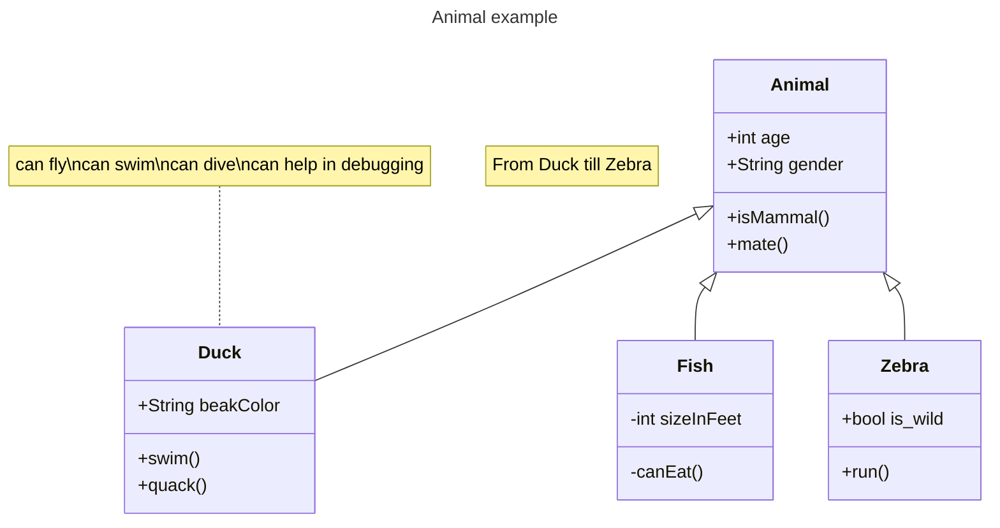
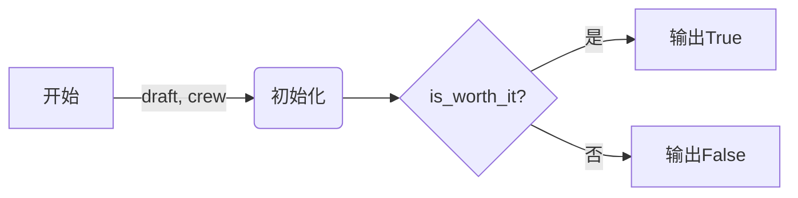
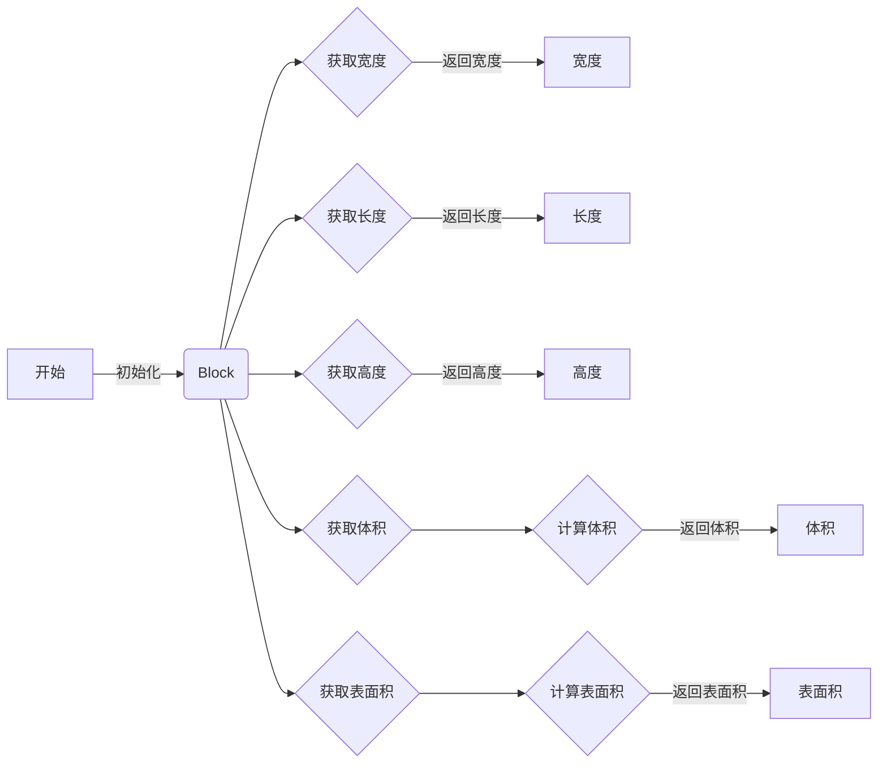
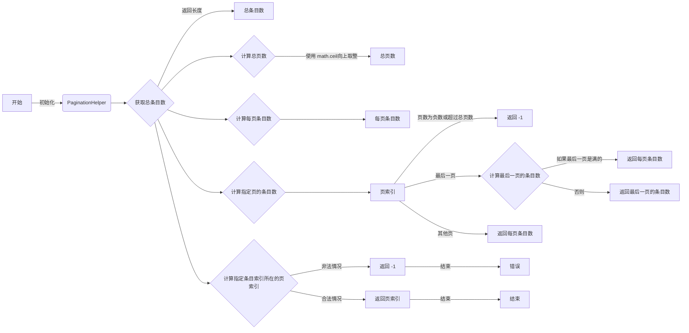
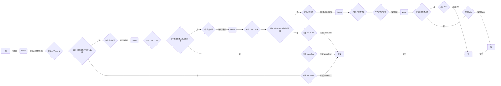
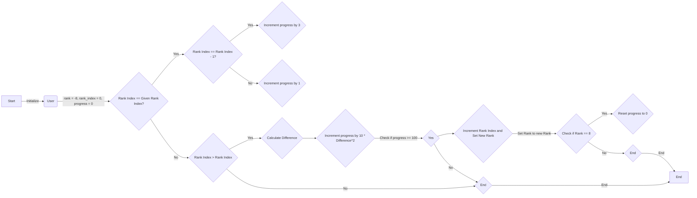

# 实验七 Python面向对象编程

班级： 21计科2班

学号： B20210302209

姓名： 章丽媛

Github地址：<https://github.com/shixiaoxiya/py_course_zly_/blob/main/Experiments/experiment7.md>

CodeWars地址：<https://www.codewars.com/users/shixiaoxiya>

---

## 实验目的

1. 学习Python类和继承的基础知识
2. 学习namedtuple和DataClass的使用

## 实验环境

1. Git
2. Python 3.10
3. VSCode
4. VSCode插件

## 实验内容和步骤

### 第一部分

Python面向对象编程

完成教材《Python编程从入门到实践》下列章节的练习：

- 第9章 类

---

### 第二部分

在[Codewars网站](https://www.codewars.com)注册账号，完成下列Kata挑战：

---

#### 第一题：面向对象的海盗

难度： 8kyu

啊哈，伙计!

你是一个小海盗团的首领。而且你有一个计划。在OOP的帮助下，你希望建立一个相当有效的系统来识别船上有大量战利品的船只。
对你来说，不幸的是，现在的人很重，那么你怎么知道一艘船上装的是黄金而不是人呢？

你首先要写一个通用的船舶类。

```python
class Ship:
    def __init__(self, draft, crew):
        self.draft = draft
        self.crew = crew
```

每当你的间谍看到一艘新船进入码头，他们将根据观察结果创建一个新的船舶对象。

- `draft`吃水 - 根据船在水中的高度来估计它的重量
- `crew`船员 - 船上船员的数量

`Titanic = Ship(15, 10)`

任务

你可以访问船舶的 "draft(吃水) "和 "crew(船员)"。"draft(吃水) "是船的总重量，"船员 "是船上的人数。
每个船员都会给船的吃水增加1.5个单位。如果除去船员的重量后，吃水仍然超过20，那么这艘船就值得掠夺。任何有这么重的船一定有很多战利品!
添加方法
`is_worth_it`
来决定这艘船是否值得掠夺。

例如：

```python
Titanic.is_worth_it()
False
```

祝你好运，愿你能找到金子!

代码提交地址：
<https://www.codewars.com/kata/54fe05c4762e2e3047000add>

---

#### 第二题： 搭建积木

难度：7kyu

写一个创建Block的类（Duh.）
构造函数应该接受一个数组作为参数，这个数组将包含3个整数，其形式为`[width, length, height]`，Block应该由这些整数创建。

定义这些方法:

- `get_width()` return the width of the `Block`
- `get_length()` return the length of the `Block`
- `get_height()` return the height of the `Block`
- `get_volume()` return the volume of the `Block`
- `get_surface_area()` return the surface area of the `Block`

例子：

```python
b = Block([2,4,6]) # create a `Block` object with a width of `2` a length of `4` and a height of `6`
b.get_width() # return 2    
b.get_length() # return 4
b.get_height() # return 6
b.get_volume() # return 48
b.get_surface_area() # return 88
```

注意： 不需要检查错误的参数。

代码提交地址：
<https://www.codewars.com/kata/55b75fcf67e558d3750000a3>

---

#### 第三题： 分页助手

难度：5kyu

在这个练习中，你将加强对分页的掌握。你将完成PaginationHelper类，这是一个实用类，有助于查询与数组有关的分页信息。
该类被设计成接收一个值的数组和一个整数，表示每页允许多少个项目。集合/数组中包含的值的类型并不相关。

下面是一些关于如何使用这个类的例子：

```python
helper = PaginationHelper(['a','b','c','d','e','f'], 4)
helper.page_count() # should == 2
helper.item_count() # should == 6
helper.page_item_count(0)  # should == 4
helper.page_item_count(1) # last page - should == 2
helper.page_item_count(2) # should == -1 since the page is invalid

# page_index takes an item index and returns the page that it belongs on
helper.page_index(5) # should == 1 (zero based index)
helper.page_index(2) # should == 0
helper.page_index(20) # should == -1
helper.page_index(-10) # should == -1 because negative indexes are invalid
```

代码提交地址：
<https://www.codewars.com/kata/515bb423de843ea99400000a>


---

#### 第四题： 向量（Vector）类

难度： 5kyu

创建一个支持加法、减法、点积和向量长度的向量（Vector）类。

举例来说：

```python
a = Vector([1, 2, 3])
b = Vector([3, 4, 5])
c = Vector([5, 6, 7, 8])

a.add(b)      # should return a new Vector([4, 6, 8])
a.subtract(b) # should return a new Vector([-2, -2, -2])
a.dot(b)      # should return 1*3 + 2*4 + 3*5 = 26
a.norm()      # should return sqrt(1^2 + 2^2 + 3^2) = sqrt(14)
a.add(c)      # raises an exception
```

如果你试图对两个不同长度的向量进行加减或点缀，你必须抛出一个错误。
向量类还应该提供：

- 一个 `__str__` 方法，这样 `str(a) === '(1,2,3)'` 
- 一个equals方法，用来检查两个具有相同成分的向量是否相等。

注意：测试案例将利用用户提供的equals方法。

代码提交地址：
<https://www.codewars.com/kata/526dad7f8c0eb5c4640000a4>

---

#### 第五题： Codewars风格的等级系统

难度： 4kyu

编写一个名为User的类，用于计算用户在类似于Codewars使用的排名系统中的进步量。

业务规则：

- 一个用户从等级-8开始，可以一直进步到8。
- 没有0（零）等级。在-1之后的下一个等级是1。
- 用户将完成活动。这些活动也有等级。
- 每当用户完成一个有等级的活动，用户的等级进度就会根据活动的等级进行更新。
- 完成活动获得的进度是相对于用户当前的等级与活动的等级而言的。
- 用户的等级进度从零开始，每当进度达到100时，用户的等级就会升级到下一个等级。
- 在上一等级时获得的任何剩余进度都将被应用于下一等级的进度（我们不会丢弃任何进度）。例外的情况是，如果没有其他等级的进展（一旦你达到8级，就没有更多的进展了）。
- 一个用户不能超过8级。
- 唯一可接受的等级值范围是-8,-7,-6,-5,-4,-3,-2,-1,1,2,3,4,5,6,7,8。任何其他的值都应该引起错误。

逻辑案例：

- 如果一个排名为-8的用户完成了一个排名为-7的活动，他们将获得10的进度。
- 如果一个排名为-8的用户完成了排名为-6的活动，他们将获得40的进展。
- 如果一个排名为-8的用户完成了排名为-5的活动，他们将获得90的进展。
- 如果一个排名-8的用户完成了排名-4的活动，他们将获得160个进度，从而使该用户升级到排名-7，并获得60个进度以获得下一个排名。
- 如果一个等级为-1的用户完成了一个等级为1的活动，他们将获得10个进度（记住，零等级会被忽略）。

代码案例：

```python
user = User()
user.rank # => -8
user.progress # => 0
user.inc_progress(-7)
user.progress # => 10
user.inc_progress(-5) # will add 90 progress
user.progress # => 0 # progress is now zero
user.rank # => -7 # rank was upgraded to -7
```

代码提交地址：
<https://www.codewars.com/kata/51fda2d95d6efda45e00004e>

---

### 第三部分

使用Mermaid绘制程序的**类图**

安装VSCode插件：

- Markdown Preview Mermaid Support
- Mermaid Markdown Syntax Highlighting

使用Markdown语法绘制你的程序绘制程序类图（至少一个），Markdown代码如下：


显示效果如下：



查看Mermaid类图的语法-->[点击这里](https://mermaid.js.org/syntax/classDiagram.html)

使用Markdown编辑器（例如VScode）编写本次实验的实验报告，包括[实验过程与结果](#实验过程与结果)、[实验考查](#实验考查)和[实验总结](#实验总结)，并将其导出为 **PDF格式** 来提交。

## 实验过程与结果

### 第一部分 Python面向对象编程

#### 9-1

```python
class Restaurant():

    def __init__(self,restaurant_name, cuisine_type):
        self.restaurant_name = restaurant_name
        self.cuisine_type = cuisine_type

    def describe_restaurant(self):
        print(f"restaurant name is {self.restaurant_name}")
        print(f"cuisine type is {self.cuisine_type}")

    def open_restaurant(self):
        print("Open")

restaurant = Restaurant("chuancai", "hot pot")

restaurant.describe_restaurant()
restaurant.open_restaurant()
```

运行结果

```python
restaurant name is chuancai
cuisine type is hot pot
Open
```

#### 9-3

```python
class User():
    def __init__(self, first_name, last_name):
        self.first_name = first_name
        self.last_name = last_name

    def describe_user(self):
        print(f"username is: " + self.first_name + " "+ self.last_name)

    def greet_user(self):
        print("hello, {}! ".format(self.last_name))

user_1 = User("John","Smith")
user_1.describe_user()
user_1.greet_user()

user_2 =User("xiao", "ming")
user_2.describe_user()
user_2.greet_user()
```

运行结果

```python
username is: John Smith
hello, Smith!
username is: xiao ming
hello, ming!
```

#### 9-4

```python
class Restaurant():

    def __init__(self,restaurant_name, cuisine_type):
        self.restaurant_name = restaurant_name
        self.cuisine_type = cuisine_type
        self.number_served = 0

    def describe_restaurant(self):
        print(f"restaurant name is {self.restaurant_name}")
        print(f"cuisine type is {self.cuisine_type}")

    def open_restaurant(self):
        print("Open")

    def set_number_served(self, number):
        self.number_served = number
        print(f"{self.number_served} person has served!")

    def increment_number_served(self, numbers):
        self.number_served += numbers
        print(f"{self.number_served} person has served!")

restaurant = Restaurant("chuancai", "hot pot")
restaurant.set_number_served(10)
restaurant.increment_number_served(20)
restaurant.increment_number_served(30)
```

运行结果

```python
10 person has served!
30 person has served!
60 person has served!
```

#### 9-5

```python
class User():
    def __init__(self, first_name, last_name):
        self.first_name = first_name
        self.last_name = last_name
        self.login_attempts = 0

    def increment_login_attempts(self):
        self.login_attempts += 1

    def reset_login_attempts(self):
        self.login_attempts = 0

user_1 = User("John","Smith")
user_1.increment_login_attempts()
user_1.increment_login_attempts()
user_1.increment_login_attempts()
print(user_1.login_attempts)

user_1.reset_login_attempts()
print(user_1.login_attempts)
```

运行结果

```python
0
3
0
```

#### 9-6

```python
class Restaurant():

    def __init__(self,restaurant_name, cuisine_type):
        self.restaurant_name = restaurant_name
        self.cuisine_type = cuisine_type

    def describe_restaurant(self):
        print(f"restaurant name is {self.restaurant_name}")
        print(f"cuisine type is {self.cuisine_type}")

    def open_restaurant(self):
        print("Open")

class IceCreamStand(Restaurant):
    def __init__(self, restaurant_name, cuisine_type):
        super().__init__(restaurant_name, cuisine_type)
        self.flavors = []

    def show_icecream(self):
        for flavor in self.flavors:
            print(flavor)

icecream = IceCreamStand("haagen-Dazs", "icecream")
icecream.flavors = ["a", "b", "c"]

icecream.show_icecream()
```

运行结果

```python
a
b
c
```

#### 9-7

```python
class User():
    def __init__(self, first_name, last_name):
        self.first_name = first_name
        self.last_name = last_name

    def describe_user(self):
        print(f"username is: " + self.first_name + " "+ self.last_name)

    def greet_user(self):
        print("hello, {}! ".format(self.last_name))

class Admin(User):
    def __init__(self, first_name, last_name):
        super().__init__(first_name, last_name)
        self.privileges =["can add post", "can delete post", "can ban user"]

    def show_privileges(self):
        for privilege in self.privileges:
            print(privilege)

admin = Admin("John", "Smith")

admin.show_privileges()
```

运行结果

```python
can add post
can delete post
can ban user
```

#### 9-8

```python
class User():
    def __init__(self, first_name, last_name):
        self.first_name = first_name
        self.last_name = last_name

    def describe_user(self):
        print(f"username is: " + self.first_name + " "+ self.last_name)

    def greet_user(self):
        print("hello, {}! ".format(self.last_name))


class Privileges():
    def __init__(self):
        self.privileges =["can add post", "can delete post", "can ban user"]

    def show_privileges(self):
        for privilege in self.privileges:
            print(privilege)

class Admin(User):
    def __init__(self, first_name, last_name):
        super().__init__(first_name, last_name)
        self.privilege = Privileges()

    def show_privileges(self):
        self.privilege.show_privileges()

admin = Admin("John", "Smith")

admin.show_privileges()
```

运行结果

```python
can add post
can delete post
can ban user
```

#### 9-9

```python
class Car():
    def __init__(self, make, model, year):
        self.make = make
        self.model = model
        self.year = year
        self.odometer_reading = 0

    def get_descriptive_name(self):
        long_name = str(self.year) + ' ' + self.make + ' ' + self.model
        return long_name.title()

class Battery():
    """一次模拟电动汽车电瓶的简单尝试"""

    def __init__(self, battery_size=60):
        """初始化电瓶的属性"""
        self.battery_size = battery_size

    def describe_battery(self):
        """打印一条描述电瓶容量的消息"""
        print("This car has a " + str(self.battery_size) + "-kWh battery.")

    def get_range(self):
        """Print a statement about the range this battery provides."""
        if self.battery_size == 60:
            range1 = 140
        elif self.battery_size == 85:
            range1 = 185

        message = "This car can go approximately " + str(range1)
        message += " miles on a full charge."
        print(message)

    def upgrade_battery(self):
        self.battery_size = 85

class ElectricCar(Car):

    def __init__(self, manufacturer, model, year):
        """
        Initialize attributes of the parent class.
        Then initialize attributes specific to an electric car.
        """
        super().__init__(manufacturer, model, year)
        self.battery = Battery()


my_tesla = ElectricCar('tesla', 'model s', 2016)
my_tesla.battery.get_range()
my_tesla.battery.upgrade_battery()
my_tesla.battery.get_range()
```

运行结果

```python
This car can go approximately 140 miles on a full charge.
This car can go approximately 185 miles on a full charge.
```

#### 9-13

```python
from collections import OrderedDict

dicts = {'list': '列表', 'str': '字符串', 'tuple': '元组', 'dict': '字典', 'int': '整型' }

dicts['split'] = '切片'
dicts['if'] =  '条件'
dicts['class'] = '类'
dicts['object'] = '对象'
dicts['boolean'] = '布尔'

order_dicts = OrderedDict()
for key, value in dicts.items():
    order_dicts[key] = value

for key, value in order_dicts.items():
    print(f"{key} : {value}")
```

运行结果

```python
list : 列表
str : 字符串
tuple : 元组
dict : 字典
int : 整型
split : 切片
if : 条件
class : 类
object : 对象
boolean : 布尔
```

#### 9-14

```python
from random import randint
x = randint(1, 6)
```

```python
from random import randint

class Die():
    def __init__(self, sides=6):
        self.sides = sides

    def roll_die(self):
        x = randint(1, self.sides)
        print(x, end=" ")

print("\n-----------6------------")
dice_6 = Die()

i = 0
while i < 10:
    dice_6.roll_die()
    i = i + 1

print("\n-----------10------------")
dice_10 = Die(10)

i = 0
while i < 10:
    dice_6.roll_die()
    i = i + 1

    dice_10 = Die(10)

print("\n-----------20------------")
dice_6 = Die(20)
i = 0
while i < 10:
    dice_6.roll_die()
    i = i + 1
```

运行结果

```python
-----------6------------
4 4 1 1 2 2 6 3 5 3
-----------10------------
5 4 4 3 2 6 4 2 1 2
-----------20------------
8 8 3 13 20 17 5 4 16 11
```

### 第二部分 Codewars Kata挑战

#### 第一题 面向对象的海盗

**代码**

```python
class Ship:
        
    def __init__(self, draft, crew):
        self.draft = draft
        self.crew = crew
    
    def is_worth_it(self):
        return self.draft - self.crew * 1.5 > 20    
        
Titanic = Ship(15, 10)
print(Titanic.is_worth_it())

treasure_ship = Ship(35.1, 10)
print(treasure_ship.is_worth_it())

```

**运行成功截图**


#### 第二题 搭建积木

**代码**

```python
class Block:
    
    def __init__(self, args):
        self.width = args[0]
        self.length = args[1]
        self.height = args[2]
        
    def get_width(self):
        return self.width
    
    def get_length(self):
        return self.length
    
    def get_height(self):
        return self.height
    
    def get_volume(self):
        return self.width * self.length * self.height
    
    def get_surface_area(self):
        return 2 * (self.width * self.length + self.width * self.height + self.length * self.height)
```

**运行成功截图**


#### 第三题 分页助手

**代码**

```python
import math

class PaginationHelper:
    
    def __init__(self, collection, items_per_page):
        self.collection = collection
        self.items_per_page = items_per_page
        
    def item_count(self):
        return len(self.collection)
    
    # 总页数
    def page_count(self):
        
        # 总条目数 / 每页条目数，然后向上取整
        return math.ceil(self.item_count() / self.items_per_page)
    
    def page_item_count(self, page_index):
        
        # 页数为负数或者页数超过总页数
        if page_index < 0 or page_index >= self.page_count():
            return -1

        # 最后一页
        elif page_index == self.page_count() - 1: 
            
            # 如果是6%4，那么最后一页就是2
            # 如果是8%4，那么最后一页就是0，说明最后一页是满的，应该返回4
            last_page = self.item_count() % self.items_per_page
            
            return self.items_per_page if last_page == 0 else last_page
        
        # 其他页
        else:
            return self.items_per_page
        
    def page_index(self, item_index):
        # 非法的情况
        if item_index < 0 or item_index >= self.item_count():
            return -1
        else:
            return item_index // self.items_per_page
```

**运行成功截图**


#### 第四题 向量（Vector）类

**代码**

```python
from math import sqrt

class Vector:

    def __init__(self, iterable):
        self._v = tuple(x for x in iterable)

    # 把打印元组时的空格去掉
    def __str__(self):
        return str(self._v).replace(' ', '')
    
    # 检查两个向量是否长度相等    
    def check(self, other):
        if not len(self._v) == len(other._v):
            raise ValueError('Vectors of different length')

    def add(self, other):
        self.check(other)
        return Vector(s + o for s, o in zip(self._v, other._v))

    def subtract(self, other):
        self.check(other)
        return Vector(s - o for s, o in zip(self._v, other._v))

    def dot(self, other):
        self.check(other)
        return sum(s * o for s, o in zip(self._v, other._v))

    def norm(self):
        return sqrt(sum(sqrt(x) for x in self._v))

    def equals(self, other):
        return self._v == other._v
```

**运行成功截图**


#### 第五题 Codewars风格的等级系统

**代码**

```python
class User ():    
    def __init__ (self):
        self.RANKS = [-8, -7, -6, -5, -4, -3, -2, -1, 1, 2, 3, 4, 5, 6, 7, 8]
        self.rank = -8
        self.rank_index = 0
        self.progress = 0
        
    def inc_progress (self, rank):
        rank_index = self.RANKS.index(rank)
        
        if rank_index == self.rank_index:
            self.progress += 3
        elif rank_index == self.rank_index - 1:
            self.progress += 1
        elif rank_index > self.rank_index:
            difference = rank_index - self.rank_index
            self.progress += 10 * difference * difference
            
        while self.progress >= 100:
            self.rank_index += 1
            self.rank = self.RANKS[self.rank_index]
            self.progress -= 100    
        
        if self.rank == 8:
            self.progress = 0
            return
```

**运行成功截图**


### 第三部分 使用Mermaid绘制程序流程图

#### 第一题 面向对象的海盗



#### 第二题 搭建积木



#### 第三题 分页助手



#### 第四题 向量（Vector）类



#### 第五题 Codewars风格的等级系统



## 实验考查

请使用自己的语言并使用尽量简短代码示例回答下面的问题，这些问题将在实验检查时用于提问和答辩以及实际的操作。

**1. Python的类中__init__方法起什么作用？**

Python中的__init__方法是一种特殊的方法，用于在创建类的实例时进行初始化操作。这意味着在实例化对象时，__init__方法会自动被调用，允许我们完成对实例的初始化工作，比如设置实例的属性或执行一些必要的设置操作。

```python
class MyClass:
    def __init__(self, x, y):
        self.x = x
        self.y = y

obj = MyClass(10, 20)
print(obj.x)  # 输出：10
print(obj.y)  # 输出：20
```

在上面的示例中，__init__方法允许我们在创建MyClass类的实例时为其设置x和y属性的初始值。

**2. Python语言中如何继承父类和改写（override）父类的方法。**

在Python中，要继承父类并重写（override）父类的方法，你可以创建一个新的子类，并在子类中定义与父类同名的方法。这样，子类就会继承父类的方法，但是可以在子类中重新定义这个方法，从而改变其行为。

下面是一个简单的示例：

```python
class ParentClass:
    def some_method(self):
        print("父类的方法")

class ChildClass(ParentClass):
    def some_method(self):  # 重写父类的方法
        print("子类重写父类的方法")

obj = ChildClass()
obj.some_method()  # 输出：子类重写父类的方法
```

在这个示例中，ChildClass继承自ParentClass，并重写了some_method方法。当你调用some_method方法时，会执行子类中重写过的方法，而不是父类中的原始方法。

**3. Python类有那些特殊的方法？它们的作用是什么？请举三个例子并编写简单的代码说明。**

Python类中有许多特殊的方法，也被称为魔术方法或双下划线方法（dunder methods），它们以双下划线开头和结尾。这些特殊方法允许我们自定义类的行为，比如实现算术运算、上下文管理、对象比较等。

以下是三个常用的特殊方法及其作用的示例：

- __init__ 方法：用于在创建对象时进行初始化操作。

```python
class MyClass:
    def __init__(self, x):
        self.x = x

obj = MyClass(10)
print(obj.x)  # 输出：10
```

- __str__ 方法：用于返回对象的字符串表示，可在打印对象时调用。

```python
class Point:
    def __init__(self, x, y):
        self.x = x
        self.y = y

    def __str__(self):
        return f"Point({self.x}, {self.y})"

p = Point(3, 4)
print(p)  # 输出：Point(3, 4)
```
- __add__ 方法：用于实现对象的加法运算。
  
```python
class Point:
    def __init__(self, x, y):
        self.x = x
        self.y = y

    def __add__(self, other):
        return Point(self.x + other.x, self.y + other.y)

p1 = Point(1, 2)
p2 = Point(3, 4)
result = p1 + p2
print(result.x, result.y)  # 输出：4 6
```

## 实验总结

总结一下这次实验你学习和使用到的知识，例如：编程工具的使用、数据结构、程序语言的语法、算法、编程技巧、编程思想。

在本次实验中，我学习和使用了以下知识：

编程语言 Python：掌握了Python类的基本定义、继承、方法重写等相关语法知识，并且学习了Python中特殊方法的使用。

编程工具的使用：通过与您的互动，我应用了Python编程语言来解释和演示相关概念。作为一名AI助手，我能够灵活地运用这些工具来满足您的需求。

编程技巧：在示例中展示了如何创建类、定义初始化方法、重写父类方法以及使用特殊方法等编程技巧，这些技巧对于构建更复杂的程序和解决实际问题非常重要。

编程思想：通过演示特殊方法的使用，展现了面向对象编程（OOP）的核心思想，包括封装、继承和多态，这些思想有助于构建模块化、可维护和可扩展的程序。

总的来说，本次实验帮助我进一步加深了对Python面向对象编程的理解，并提升了我在编程方面的技能和知识水平。