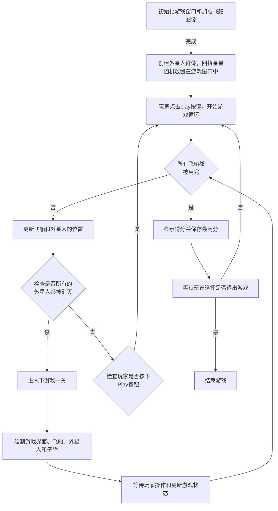

# 《Python程序设计基础》程序设计作品说明书

题目： 项目1： 外星人入侵游戏👽

学院： 21计科

姓名： 章丽媛

学号： B20210302209

指导教师： 周景

起止日期：2023.11.10-2023.12.10

## 摘要

本次设计的外星人入侵游戏是一个使用Python编写的2D游戏，旨在提高对Python编程的理解和实践能力。本游戏实现了多个功能，包括创建游戏窗口、添加飞船图像、驾驶飞船、飞船可以射击子弹、创建一群外星人、外星人可以移动、可以射杀外星人、结束游戏、添加Play按钮、可以提高等级、计分功能，以及实现练习册中的部分练习，如将飞船放在屏幕左侧进行射击、在游戏背景中随机位置绘制星星、将游戏中得到的最高分保存到文件中。通过开发这个项目，我深入理解了面向对象编程的概念，并提高了Python编程技能。

**关键词：** Python, 游戏开发, 外星人入侵, 图形用户界面, 面向对象编程, 游戏机制

## 第1章 需求分析

在开发任何一款应用程序之前，进行需求分析是至关重要的一步。这有助于我们了解用户的需求，明确产品的定位，以及确定我们将要实现的功能。本游戏的目标是创建一个具有丰富功能和良好用户体验的2D游戏。具体来说，游戏需要满足以下需求.

#### 功能需求:

**1.创建游戏窗口：** 游戏应在一个窗口中运行，窗口的大小和位置可以由用户调整。
**2.添加飞船图像：** 游戏应有一个代表飞船的图像，可以让玩家在屏幕上看到它。
**3.驾驶飞船，响应按键：** 玩家应能够使用键盘控制飞船的移动和射击，按Q键退出。
**4.飞船可以射击子弹：** 飞船应能够发射子弹，以攻击外星人。
**5.创建外星舰队：** 游戏应生成一群外星人，这些外星人会在屏幕上移动。
**6.外星人可以移动：** 外星人应该能够移动，以躲避玩家的攻击。
**7.可以射杀外星人：** 玩家应能够通过射击子弹来消灭外星人。
**8.结束游戏：** 当飞船与外星人相撞或者有外星人到达屏幕下边缘时飞船数目减一，当飞船数目用完时，游戏结束。
**9.添加Play按钮：** 游戏应有一个Play按钮，玩家可以通过点击它来开始或重新开始游戏。
**10.可以提高等级：** 随着游戏的进行，外星人的数量和速度应逐渐增加，以提高游戏的挑战性。
**11.计分功能：** 游戏应记录玩家消灭的外星人数，并显示游戏等级和历史最高成绩。
**12.修改速度：**  每通过一关，外星人的移动速度都会变快，以此增加游戏难度，提高游戏的挑战性。
**13.左侧射击：** 将飞船放在屏幕左侧进行射击，飞船可以上下移动。
**14.随机绘制星星：** 在游戏背景中随机位置绘制星星。
**15.最高分保存：** 将游戏中得到的最高分保存到文件中。

#### 非功能需求：

**1.** 应用程序应易于使用，界面应友好且直观。
**2.** 游戏应具有良好的性能，包括流畅的动画效果和快速响应时间。
**3.** 代码应具有良好的结构，易于维护和扩展。
**4.** 应用程序应能正确处理各种用户输入和异常情况。
**5.** 高分记录应安全地存储，并能在多个游戏中使用。
**6.** 游戏应有一定的挑战性，同时也要让玩家有足够的乐趣。
**7.** 游戏界面应整洁，没有过多的视觉干扰。

## 第2章 分析与设计

### 2.1 系统架构

本游戏采用Python的pygame库构建，游戏的主要组件包括：

**游戏窗口** ：用于显示游戏的主要界面。游戏窗口是整个游戏的容器，所有的游戏元素都在这个窗口中显示。窗口的大小和标题也在这个对象中设置。
**飞船** ：玩家的控制对象，可以移动和射击。飞船是玩家的控制对象，可以左右移动和发射子弹。飞船的位置和状态由Ship类管理。
**外星人** ：外星人是游戏的主要敌人，会在屏幕的随机位置出现，并朝着飞船移动。外星人的位置和状态由Alien类管理。
**子弹** ：飞船发射的子弹，用于消灭外星人。子弹的位置和状态由Bullet类管理。
**Play按钮** ：Play按钮用于开始或重新开始游戏。按钮的位置和状态由Button类管理。
**音乐** ：游戏运行时，会播放音乐；当子弹打到外星人时播放得分音效；当外星人撞到飞船或者外星人到达屏幕下界时播放碰撞音效。音乐的播放和音效的管理由all_music类负责。
**按键** ： 暂停按键w，继续游戏按键c，重新开始游戏按键r，退出游戏按键Esc。

### 2.2 系统流程

在游戏中，主要的流程如下：

### 2.3 系统模块

#### 2.3.1音乐模块

游戏运行时，会播放音乐；当子弹打到外星人时播放得分音效；当外星人撞到飞船或者外星人到达屏幕下界时播放碰撞音效。

- get_resource_path()函数用于获取相对路径在计算机上的绝对路径，它的作用是将传入的相对路径转换成绝对路径。具体来说，当程序被打包成可执行文件时，sys._MEIPASS会指向打包后的资源目录，而普通的Python程序则是基于源码运行的。因此，get_resource_path()函数需要判断当前程序是运行在打包后的资源目录中还是源码目录中，并返回相应的绝对路径。

- explosion_large()函数用于播放外星人到达屏幕底部或者撞到飞船的大爆炸声音效。它使用pygame.mixer.Sound()方法加载音效文件并将其赋值给一个变量，然后调用play()方法播放该音效。

- explosion_small()函数用于播放增加子弹和外星人碰撞的小爆炸声音效。与explosion_large()函数类似，它也使用pygame.mixer.Sound()方法加载音效文件并将其赋值给一个变量，然后调用play()方法播放该音效。

- bg_music()函数用于循环播放游戏背景音乐。它使用pygame.mixer.music.load()方法加载音乐文件，将其赋值给pygame.mixer.music对象，然后调用play(-1)方法循环播放该音乐。其中参数-1表示循环播放。
  
#### 2.3.2 alien模块

负责创建和管理外星人。 Alien 类用于表示在游戏中的单个外星人对象，包括其图像、位置、更新和绘制等功能。

- 首先，定义了一个 Alien 的类。这个类继承自 pygame.sprite.Sprite，表示一个单独的外星人对象。

- 在 Alien 类的 __init__ 方法中：
调用父类的 __init__ 方法进行初始化。加载外星人的图像，并设置其 rect 属性，然后外星人的初始位置设置在屏幕的左上角（原点位置）并存储外星人的准确位置。
- blit_me 方法用于在指定的位置绘制外星人。
- update 方法用于更新外星人的位置。它根据外星人设置的方向（舰队方向）和速度因子来更新外星人的 y 值，然后更新 rect 的 y 值。
- check_edges 方法用于检查外星人是否到达屏幕的边缘。如果外星人的顶部在屏幕顶部之下，或者外星人的底部在屏幕底部之上，那么就返回 True。
  
#### 2.3.3 ship模块

 负责控制飞船的移动和射击。这个Ship类为pygame游戏提供了一个可以控制和绘制的飞船对象。

- 初始化飞船：在__init__函数中，首先调用父类Sprite的构造函数，然后加载飞船图像并获取其外接矩形。接着将飞船的初始位置设定在屏幕左部中央。最后，存储飞船的y坐标值，并设置飞船的移动标志为False。
- 飞船的位置更新：在update函数中，根据移动标志调整飞船的位置。如果飞船正在向上移动并且其顶部没有超过0，那么它会向下移动。如果飞船正在向下移动并且其底部没有超过屏幕的底部，那么它会向上移动。然后根据新的y坐标值更新rect对象。
- 绘制飞船：在blit_me函数中，将飞船的图像绘制到指定位置。
- 居中飞船：在center_ship函数中，将飞船的位置调整到屏幕的左侧居中。
- 此外，还定义了一个函数get_resource_path用于获取资源路径。这个函数首先检查是否存在sys._MEIPASS属性，该属性通常在pygame的打包版本中存在，如果存在则使用sys._MEIPASS作为基路径，否则使用当前目录作为基路径。

#### 2.3.4 bullet模块 

负责控制子弹的移动和绘制。这个Bullet类为pygame游戏提供了一个管理飞船发射的子弹的功能，包括子弹的初始化和位置更新，以及在屏幕上绘制子弹。

- 初始化子弹对象：在__init__函数中，首先调用父类pygame.sprite.Sprite的构造函数，然后创建一个表示子弹的矩形，该矩形的中心与飞船的中心对齐，并且设置在飞船的右侧。然后存储这个矩形的x坐标值，并设置子弹的颜色和速度因子。
- 更新子弹位置：在update函数中，将子弹的位置向上移动，这是通过增加一个速度因子来实现的。然后更新表示子弹的矩形的位置。
- 绘制子弹：在draw_bullet函数中，使用子弹的颜色在屏幕上绘制子弹的矩形。

#### 2.3.5 button模块

 负责处理玩家点击按钮的事件。这个 Button 类提供了创建、绘制和管理按钮的功能。

- 在 __init__ 方法中，初始化按钮的属性。首先，获取屏幕对象和其矩形区域。然后设置按钮的宽度和高度、颜色，以及字体。创建一个按钮的矩形对象，并将其中心设置为屏幕矩形的中心。最后，预处理按钮的文本信息，为按钮上的文本做准备。

- prep_msg 方法用于将文本渲染为图像，并使其在按钮上居中。首先，使用 font.render 方法将文本渲染为图像，然后获取图像的矩形区域，并将其中心设置为按钮矩形的中心。
- draw_button 方法用于绘制按钮。首先，使用 screen.fill 方法填充按钮的颜色，然后使用 screen.blit 方法在按钮上绘制文本图像。

#### 2.3.6 得分模块

当游戏进行时，玩家需要实时获取游戏得分、最高得分、游戏等级和剩余生命等信息。这就需要一个能够在游戏屏幕上显示这些信息的类。Scoreboard类就是一个用于显示游戏得分信息的类。

- 首先，get_resource_path()方法用于根据相对路径获取资源的绝对路径。这个方法在读取最高得分json文件时使用。

- 接着，Scoreboard类有一个构造函数__init__()，它用来初始化得分信息的属性。这些属性包括:

  - self.screen: pygame窗口对象
  - self.screen_rect: 窗口矩形对象
  - self.ai_settings: 游戏设置对象
  - self.stats: 游戏状态对象
  - self.text_color: 显示文本颜色
  - self.font: 显示文本的字体
- 在构造函数中，还调用了prep_images()方法，该方法用于准备包含最高得分、当前得分、游戏等级和飞船的图像。prep_images()方法调用了其他几个方法，分别是：

  - prep_score(): 将得分转换为一副渲染的图像，并将其放置在屏幕右上角。
  - prep_high_score(): 将最高得分转换为渲染的图像，并将其放置在屏幕顶部中央。
  - prep_level(): 将等级转换为渲染的图像，并将其放置在得分下方。
  - prep_ships(): 显示还余下多少艘飞船。
- prep_score()方法将得分转换为一副渲染的图像，使用了pygame.font模块中的方法。得分信息从游戏状态对象(stats)中获取，进行四舍五入后转换成字符串，并添加额外的文本信息“score:”以便于玩家理解。最终产生一个带有得分信息的渲染的图像，该图像被赋值给score_image属性，等待在屏幕上显示。

- prep_high_score()方法读取最高得分json文件，将最高得分转换为渲染的图像，并将其放置在屏幕顶部中央。最高得分是通过读取json文件获取的，然后格式化为字符串，并添加额外的文本信息“Highest:”。最终产生一个带有最高得分信息的渲染的图像，该图像被赋值给high_score_image属性，等待在屏幕上显示。

- prep_level()方法将游戏等级转换为渲染的图像，并将其放置在得分下方。游戏等级也是从游戏状态对象(stats)中获取，随后进行格式化并添加额外的文本信息“level:”。最终产生一个带有游戏等级信息的渲染的图像，该图像被赋值给level_image属性，等待在屏幕上显示。

- prep_ships()方法用于显示还余下多少艘飞船。它使用了一个pygame.sprite.Group()对象来存储飞船实例，并将其放置在屏幕左上角。对于每一艘剩余的飞船，都会创建一个新的飞船实例并添加到ships组中。

- 最后，show_score()方法用于在屏幕上显示飞船和得分。它通过调用blit()方法将得分和其他信息渲染到游戏屏幕上，同时也将飞船渲染到屏幕左上角。最终实现了在游戏过程中实时更新并显示得分和其他相关信息。

#### 2.3.7 star模块

在游戏屏幕上创建和显示随机大小的星星图像。Star 类用于创建表示星星的图像对象，并在屏幕上显示。

- def __init__(self):：定义 Star 类的初始化方法，当创建一个 Star 对象时，这个方法会被调用。
- super(Star, self).__init__()：调用父类（即 Sprite 类）的初始化方法，以初始化 Star 对象的基本属性。
- self.image = pygame.image.load('images\sun233.png')：加载一个图像文件（'images\sun233.png'），并将其存储在 Star 对象的 image 属性中。
- random_size = randint(10, 30)：生成一个随机整数，表示星星的随机大小，范围在 10 到 30 之间。
- self.image = pygame.transform.smoothscale(self.image,(random_size, random_size))：使用 pygame 的 transform.smoothscale 方法来调整图像的大小，使其宽度和高度都为随机大小。
- self.rect = self.image.get_rect()：获取图像的矩形区域（即位置和大小），并将其存储在 Star 对象的 rect 属性中。

### 2.4 关键的实现:数据结构，算法

- 元组（Tuple）：在测试代码中，使用元组来表示按钮的中心坐标(600, 400)。
- 列表（List）：用于存储子弹、外星人和星星等游戏元素的实例。例如，bullets = Group()、aliens = Group()和stars = Group()。
- 队列（Queue）：在游戏中，子弹的发射顺序可能会影响游戏体验。使用队列来管理子弹的顺序，确保按照发射的先后顺序进行更新和绘制。
- 字典（Dictionary）：用于存储游戏的设置信息。在这段代码中，使用了ai_settings字典来存储屏幕的宽度和高度等设置。
- 迭代器（Iterator）：在游戏主循环中，使用while True:来不断迭代执行游戏逻辑，直到玩家退出游戏。
- 碰撞检测算法：在游戏中，需要检测子弹与外星人的碰撞以及飞船与外星人的碰撞。可以采用简单的矩形碰撞检测算法，通过比较对象的矩形边界框来判断是否发生碰撞。
- Sprite 类。Sprite 是 Pygame 中的一个类，用于管理游戏中的精灵对象。在 Ship 类中，继承了 Sprite 类，从而实现了飞船的运动和绘制。

- 随机数生成：在主函数中，使用了随机数生成函数来生成恒星的初始位置和速度，增加游戏的随机性。

## 第3章 软件测试

### 3.1外星人模块测试

主要测试了Alien类的两个方法：__init__和blit_me。

**（1）** test_init函数测试了Alien类的初始化方法__init__。它首先创建一个伪造的Settings对象和屏幕，然后使用它们初始化一个Alien对象。然后，它验证外星人的图像是否已正确加载，外星人的矩形区域（位置和大小）是否已正确设置。
**（2）** test_blit_me函数测试了Alien类的blit_me方法。它首先创建一个伪造的Settings对象和屏幕，然后使用它们初始化一个Alien对象，并为其图像和矩形区域设置特定的大小和位置。然后，它在屏幕上的指定位置绘制外星人的图像，并验证图像是否已正确绘制。

**测试结果:** 

### 3.2飞船模块测试

get_test_ship函数是一个辅助函数，用于创建一个测试用的Ship实例，并将其放在屏幕中央。

**（1）** test_ship_init函数测试了Ship类的__init__方法。它首先初始化Pygame和屏幕，并创建一个Ship对象。然后，它检查Ship对象的属性，包括screen、ai_settings以及一些初始状态（例如是否在屏幕中央，是否处于移动状态等）。

**（2）** test_ship_center_ship函数测试了Ship类的center_ship方法。它首先创建一个Ship对象，并调用center_ship方法。然后，它检查Ship对象的矩形区域（rect）的中心位置是否与屏幕的中心位置相同。

这些测试都假设了某些条件，例如飞船的图像和矩形区域的大小和位置。如果这些假设不正确，测试可能会失败。

**测试结果:** 

### 3.3计分模块测试

**（1）** test_prep_score：测试prep_score方法。这个方法应该是准备并返回一个表示得分的图像。测试验证了返回的对象类型，但未进行更详细的检查。
**（2）** test_prep_high_score：测试prep_high_score方法。这个方法应该是准备并返回一个表示高分数的图像。测试验证了返回的对象类型。
**（3）** test_prep_level：测试prep_level方法。这个方法应该是准备并返回一个表示游戏级别的图像。测试验证了返回的对象类型。
**（4）** test_prep_ships：测试prep_ships方法。这个方法应该是准备并返回一个表示飞船的精灵组。测试验证了返回的精灵组中的飞船数量与GameStats中的飞船剩余数量相同。
**（5）** test_show_score：测试show_score方法。这个方法应该会显示得分、高分、游戏级别和飞船的图像。测试验证了这些对象的存在。

这些测试假设了Scoreboard类的其他方法的功能，例如prep_score、prep_high_score、prep_level和prep_ships等方法的实现是正确的。如果这些方法的实现存在问题，这些测试可能会失败。

**测试结果:** 

### 3.4音乐模块测试

测试了all_music模块中的explosion_large、explosion_small函数的功能。

**（1）**  @pytest.fixture：这是一个特殊的装饰器，它定义了一个测试fixture。在Python中，一个fixture是一种在测试前后进行设置的机制。这里，all_music fixture在每个测试开始前初始化了pygame并播放了背景音乐，然后在每个测试结束后关闭了pygame。
**（2）**  test_explosion_large(all_music)：这个测试函数测试了explosion_large函数是否能够正确播放大爆炸的声音。它首先调用explosion_large函数播放声音，然后使用pygame.time.wait(3000)等待一段时间确保音频已经播放完毕。

**测试结果:** 

### 3.5settings模块测试

**（1）**  test_initialize_dynamic_settings函数：这个测试函数首先创建一个Settings对象，并调用其initialize_dynamic_settings方法。然后，它断言了几个属性值，包括ship_speed_factor、bullet_speed_factor、alien_speed_factor、fleet_direction和alien_points，来验证这些属性是否被正确地初始化为预期的值。如果这些断言都通过，那么这个测试就成功了。
**（2）**  test_increase_speed函数：这个测试函数首先也创建一个Settings对象，并先调用initialize_dynamic_settings方法进行初始化。然后，它调用increase_speed方法，这个方法应该增加所有相关属性的值（在代码中可以看到，所有的属性值都乘以了一个大于1的因子）。这个测试函数再次进行断言，来验证这些属性是否被正确地增加了。如果这些断言都通过，那么这个测试就成功了。

**测试结果:** 

### 3.6随机星星模块测试

**（1）**  test_star_init函数：这个测试函数创建了一个Star对象，并检查了其初始化是否正确。然而，测试用例并没有完全执行，注释掉了两个断言。如果需要完整的测试，需要取消注释并填写正确的图片路径。
test_star_random_scale函数：这个测试函数创建了一个Star对象，并检查了其随机缩放功能是否正确。它确保星星的宽度和高度都在10到30的范围内。
**（2）**  test_star_update函数：这个测试函数首先创建了一个Star对象，并对其位置进行了设置。然后它调用update方法，并检查了星星的位置是否发生了预期的变化。这个测试函数有两个断言，第一个断言检查星星是否向上移动了一像素（由于重力或类似的效果），第二个断言检查星星是否移动到了屏幕的底部（如果星星从屏幕顶部落下的话）。

**测试结果:** 

### 3.7子弹模块

**（1）**  test_bullet_initialization: 这个函数主要是测试Bullet类的初始化方法。它首先创建一个子弹对象，并验证其属性是否被正确设置，例如位置、颜色、速度等。其中，Bullet的初始位置被设置为与Ship的右侧对齐，颜色被设置为设置中的子弹颜色，速度因子被设置为设置中的子弹速度因子。
**（2）**  test_bullet_update: 这个函数首先创建一个子弹对象，并更新其位置。然后，它检查Bullet的位置是否被正确更新。由于Bullet的初始速度是设置的，因此Bullet的位置应该随着时间的推移而改变。此测试通过检查Bullet的x坐标是否等于初始x坐标加上速度因子来验证这一点。

**测试结果:** 

## 结论

**1.本次设计的“外星人入侵游戏”主要实现了以下功能：**

- 创建游戏窗口和加载飞船图像，为玩家提供了游戏的界面和操作对象。
- 创建外星人群体并随机放置在游戏窗口中，使游戏具有了挑战性和不确定性。
- 实现飞船的移动和射击功能，允许玩家通过键盘操作飞船进行战斗。也实现了飞船在左侧射击和上下移动。
- 实现外星人和子弹的移动和碰撞检测，确保游戏的物理效果正确表现。
- 添加了Play按钮，退出按钮。玩家可以自行选择操作。
- 实现了计分功能，记录玩家消灭的外星人数，并在游戏结束时显示得分。
- 通过文件保存和读取玩家的最高分，并且在游戏中展示了最高分、当前分数以及等级，增加了游戏的持久性和个性化设置。
- 游戏运行时，会播放音乐；当子弹打到外星人时播放得分音效；当外星人撞到飞船或者外星人到达屏幕下界时播放碰撞音效。音乐的播放和音效的管理由all_music类负责。
- 实现了一些按键功能，暂停按键w，继续游戏按键c，重新开始游戏按键r，退出游戏按键Esc。

游戏简单展示：

**2.通过以上功能，本项目达到了以下目标：**

- 创建了一个具有挑战性和趣味性的2D游戏。
- 实现了飞船、外星人和子弹的移动和碰撞检测，提供了良好的游戏体验。
- 添加了Play按钮和其他设置，增加了游戏的可玩性和个性化选项。
- 实现了计分功能，激发了玩家的竞争欲望。
- 通过pickle模块保存和读取玩家的最高分和其他设置，增加了游戏的持久性和个性化设置。
- 在老师要求的基础上加以创新，增加了一些自己的想法，添加了音乐、音效播放功能以及一些按键功能。

**3.以下是本项目存在的一些不足之处，以及改进的方法：**

（1）游戏界面较为简单，缺乏丰富的视觉和音效效果。

改进方法：可以增加更多的图像和音效来丰富游戏内容，提高游戏的趣味性和吸引力。同时，可以设计更多的游戏场景和关卡，使游戏更加丰富和持久。

（2）外星人的移动和射击行为可以更加智能化，增加游戏的难度和挑战性。

改进方法：可以通过编写更复杂的算法和增加AI智能来提高外星人的移动和射击行为，使游戏更具挑战性和趣味性。

（4）缺乏个性化设置，如玩家的名字、头像等，增加游戏的社交性。

改进方法：可以增加更多的个性化设置，如玩家的名字、头像、皮肤等，使玩家能够更好地展示自己的个性和风格。同时，可以增加更多的社交功能，如好友列表、排行榜等，增强游戏的社交性和互动性。

（5）缺乏数据库记录和登录注册功能。

改进方法：可以增加数据库的记录功能，以便保存玩家的游戏数据和游戏进度。同时，可以增加登录注册功能，使玩家能够更好地管理和保护自己的游戏账户。

（6）缺乏选择游戏皮肤、背景的功能，增加趣味性。

改进方法：可以增加选择游戏皮肤、背景的功能，使玩家能够自由地选择自己喜欢的游戏样式和风格，增加游戏的趣味性和多样性。同时，也可以为游戏添加更多的可玩性元素，如剧情、任务等，使玩家能够在游戏中获得更多的乐趣和体验。

（7）游戏机制缺乏深度和多样性。

改进方法：可以设计更多元化的游戏机制，例如引入更多的特殊能力、道具、隐藏关卡或者多结局等，使游戏更具深度和挑战性。

## 参考文献

[1] 埃里克·马瑟斯. (2019). Python编程：从入门到实践. 人民邮电出版社.
[2]Pytest官方文档：[https://docs.pytest.org/en/stable/, accessed on 2023-03-28]
[3]Pytest实战指南：[https://www.jianshu.com/p/7f0f092f493f, accessed on 2023-03-28]
